# Euonia

Euonia is a development framework and toolkit library for building .NET applications and services. It provides a comprehensive, modular solution that empowers developers to build efficient, scalable, and robust systems capable of handling complex distributed workflows. Whether you are working on microservices, cloud-native applications, or any other distributed system, Euonia offers a range of features, tools, and infrastructure to streamline your development process and enhance the overall performance of your project.

> The word *eunoia* derives from ancient Greek — combining *eu* ("good" or "well") and *noos* ("mind" or "thinking"). It signifies a state of goodwill, beautiful thinking, and a well-disposed mind, embodying positive mindset, open-heartedness, and sincerity. It is often associated with inner peace and harmonious connections with others.

## Projects

### Dependency Graph

```mermaid
graph TD
    Euonia.Modularity --> Euonia.Core
    Euonia.Hosting --> Euonia.Modularity

    Euonia.Threading.ZooKeeper --> Euonia.Threading
    Euonia.Threading.Redis --> Euonia.Threading
    Euonia.Threading.FileSystem --> Euonia.Threading
    Euonia.Threading.Azure --> Euonia.Threading
    Euonia.Threading --> Euonia.Core

    Euonia.Mapping.Mapster --> Euonia.Mapping
    Euonia.Mapping.Automapper --> Euonia.Mapping

    Euonia.Repository.Mongo --> Euonia.Repository
    Euonia.Repository.EfCore --> Euonia.Repository
    Euonia.Repository --> Euonia.Domain
    Euonia.Repository --> Euonia.Modularity
    Euonia.Domain --> Euonia.Linq
    Euonia.Domain --> Euonia.Core

    Euonia.Application --> Euonia.Bus
    Euonia.Application --> Euonia.Pipeline
    Euonia.Application --> Euonia.Validation
    Euonia.Bus --> Euonia.Bus.Abstract
    Euonia.Bus --> Euonia.Domain
    Euonia.Bus --> Euonia.Modularity
    Euonia.Bus.InMemory --> Euonia.Bus.Abstract
    Euonia.Bus.RabbitMq --> Euonia.Bus.Abstract
    Euonia.Bus.ActiveMq --> Euonia.Bus.Abstract

    Euonia.Caching.Memory --> Euonia.Caching
    Euonia.Caching.Runtime --> Euonia.Caching
    Euonia.Caching.Redis --> Euonia.Caching

    Euonia.Uow --> Euonia.Domain
    Euonia.Uow --> Euonia.Repository
```

## Core Module

- **[Euonia.Core](Source/Euonia.Core)** — Core library providing base classes, helpers, and extension methods.
- **[Euonia.Osba](Source/Euonia.Osba)** — Object-oriented & scalable business architecture library.
- **[Euonia.Grpc](Source/Euonia.Grpc)** — Tools and features to seamlessly integrate gRPC capabilities into your projects.
- **[Euonia.Hosting](Source/Euonia.Hosting)** — Helps developers quickly build a host for .NET applications and services.
- **[Euonia.Linq](Source/Euonia.Linq)** — Toolkit library for LINQ, providing additional query operators and utilities.
- **[Euonia.Modularity](Source/Euonia.Modularity)** — Modular application framework for building pluggable, extensible systems.
- **[Euonia.Pipeline](Source/Euonia.Pipeline)** — Pipeline/chain-of-responsibility pattern implementation for processing workflows.
- **[Euonia.Validation](Source/Euonia.Validation)** — Customizable validation capabilities for various data inputs.
- **[Euonia.Quartz](Source/Euonia.Quartz)** — Simple and easy-to-use library for scheduling jobs with Quartz.NET.

## Caching Module

- **[Euonia.Caching](Source/Euonia.Caching)** — Abstract classes and interfaces for caching services.
- **[Euonia.Caching.Redis](Source/Euonia.Caching.Redis)** — Redis implementation of `ICachingService`.
- **[Euonia.Caching.Memory](Source/Euonia.Caching.Memory)** — In-memory implementation using `Microsoft.Extensions.Caching.Memory`.
- **[Euonia.Caching.Runtime](Source/Euonia.Caching.Runtime)** — Runtime caching implementation using `System.Runtime.Caching`.

## Domain Driven Design Module

- **[Euonia.Application](Source/Euonia.Application)** — Abstract application service classes and interfaces for DDD application layers.
- **[Euonia.Domain](Source/Euonia.Domain)** — Abstract domain service classes and interfaces, including entities, value objects, and domain events.
- **[Euonia.Repository](Source/Euonia.Repository)** — Abstract repository classes and interfaces for data access abstraction.
- **[Euonia.Repository.EfCore](Source/Euonia.Repository.EfCore)** — Entity Framework Core implementation of `IRepository`.
- **[Euonia.Repository.Mongo](Source/Euonia.Repository.Mongo)** — MongoDB implementation of `IRepository`.

## Message Bus Module

- **[Euonia.Bus.Abstract](Source/Euonia.Bus.Abstract)** — Abstract contracts and base classes for message bus implementations.
- **[Euonia.Bus](Source/Euonia.Bus)** — Core message bus library providing routing, dispatching, and middleware support.
- **[Euonia.Bus.InMemory](Source/Euonia.Bus.InMemory)** — In-memory message bus implementation for testing and single-process scenarios.
- **[Euonia.Bus.RabbitMq](Source/Euonia.Bus.RabbitMq)** — RabbitMQ message bus implementation for distributed messaging.
- **[Euonia.Bus.ActiveMq](Source/Euonia.Bus.ActiveMq)** — ActiveMQ message bus implementation for distributed messaging.

## Object Mapping Module

- **[Euonia.Mapping](Source/Euonia.Mapping)** — Abstract mapping contracts and utilities.
- **[Euonia.Mapping.Mapster](Source/Euonia.Mapping.Mapster)** — Mapster-based object mapping implementation.
- **[Euonia.Mapping.Automapper](Source/Euonia.Mapping.Automapper)** — AutoMapper-based object mapping implementation.

## Threading Module

- **[Euonia.Threading](Source/Euonia.Threading)** — Abstract distributed locking and synchronization primitives.
- **[Euonia.Threading.ZooKeeper](Source/Euonia.Threading.ZooKeeper)** — ZooKeeper-based distributed lock implementation.
- **[Euonia.Threading.Redis](Source/Euonia.Threading.Redis)** — Redis-based distributed lock implementation.
- **[Euonia.Threading.FileSystem](Source/Euonia.Threading.FileSystem)** — File-system-based distributed lock implementation.
- **[Euonia.Threading.Azure](Source/Euonia.Threading.Azure)** — Azure-based distributed lock implementation.

## Unit of Work Module

- **[Euonia.Uow](Source/Euonia.Uow)** — Unit of Work pattern implementation for managing transactional data access across multiple repositories.

## Samples

- **[Euonia.Sample.Webapi](Samples/Euonia.Sample.Webapi)** — Sample Web API project demonstrating Euonia framework usage.

---

## Donate

---

Thanks to [JetBrains](https://www.jetbrains.com/) for supporting the project through [All Products Packs](https://www.jetbrains.com/products.html) within their [Free Open Source License](https://www.jetbrains.com/community/opensource) program.

---

