# Euonia (.NET)

> *Eunoia* — from Greek *εὔνοια*: beautiful thinking, goodwill, a well-disposed mind.

Euonia is a development framework for building enterprise .NET applications and services. It combines **Object-Oriented Scalable Business Architecture (OSBA)** with **Domain-Driven Design (DDD)** principles to provide a comprehensive foundation for creating robust, maintainable business applications. The framework is built on **.NET 9/10** and integrates seamlessly with **ASP.NET Core**.

Euonia is also available for **[Java](https://github.com/euonia-project/euonia-java)** — this repository hosts the **.NET edition**.

---

## Modules

```mermaid
graph TD
    subgraph "Euonia .NET"
        direction TB
        Modularity --> Core
        Hosting --> Modularity
        DDD["Domain"] --> Core
        DDD --> Linq
        Application --> Bus
        Application --> Pipeline
        Application --> Validation
        Bus --> BusAbstract
        Bus --> DDD
        Bus --> Modularity
        BusAbstract --> Core
        BusInMemory --> BusAbstract
        BusInMemory --> Core
        BusRabbitMq --> BusAbstract
        BusRabbitMq --> Core
        BusActiveMq --> BusAbstract
        Repository --> DDD
        Repository --> Modularity
        RepositoryEfCore --> Repository
        RepositoryMongo --> Repository
        UoW --> DDD
        UoW --> Repository
        Pipeline --> Core
        OSBA --> Core
        CachingRedis --> Caching
        CachingMemory --> Caching
        CachingRuntime --> Caching
        ThrdZooKeeper["Threading.ZooKeeper"] --> Threading
        ThrdRedis["Threading.Redis"] --> Threading
        ThrdFS["Threading.FileSystem"] --> Threading
        ThrdAzure["Threading.Azure"] --> Threading
        Threading --> Core
        MappingMapster --> Mapping
        MappingAutomapper --> Mapping
        Sample --> Application
        Sample --> OSBA
        Sample --> Modularity
        Sample --> Hosting
        Sample --> RepositoryEfCore
        Sample --> BusInMemory
        Sample --> BusRabbitMq
        Sample --> MappingAutomapper
        Sample --> MappingMapster
    end

    style Core fill:#4A90D9,color:#fff
    style DDD fill:#50B86C,color:#fff
    style UoW fill:#1F6FEB,color:#fff
    style OSBA fill:#E8833A,color:#fff
    style Pipeline fill:#E74C3C,color:#fff
    style Modularity fill:#2ECC71,color:#fff
    style BusAbstract fill:#F39C12,color:#fff
    style Bus fill:#E67E22,color:#fff
    style BusInMemory fill:#D35400,color:#fff
    style BusRabbitMq fill:#C0392B,color:#fff
    style BusActiveMq fill:#8E44AD,color:#fff
    style Sample fill:#9B59B6,color:#fff
```



### Core (`Euonia.Core`)
> Foundation library: base classes, ID generation, reflection utilities, tuples, HTTP exceptions, security primitives, async coordination, and disposable patterns.

| Namespace | Description |
|-----------|-------------|
| `Nerosoft.Euonia` | `ObjectId` (unified ID — supports Snowflake, UUID, ULID, Random), `ShortUniqueId` (Hashids-based short IDs), `Singleton<T>`, `Clock`, `Check` (assertions), `Unit` (void replacement), `Weak<T>` |
| `Nerosoft.Euonia.Collections` | `DequeCollection<T>`, `PageableCollection<T>`, `TreeView<T>`, `TypeList<T>`, `ObservableGroup<TKey,TValue>`, `ViewCollection<T>` |
| `Nerosoft.Euonia.Disposing` | `SingleDisposable<T>`, `AsyncSingleDisposable<T>`, `CollectionDisposable`, `NoopDisposable` — exactly-once, thread-safe disposal (sync & async) |
| `Nerosoft.Euonia.Reflection` | `AssemblyHelper`, `TypeHelper`, `Reflect` / `Reflect<TTarget>`, `EnumHelper`, `PropertyAccessorCache<T>`, `MethodInvokerBuilder` |
| `Nerosoft.Euonia.Security` | `UserPrincipal` (wraps `ClaimsPrincipal`), `UserClaimTypes` (OIDC constants), exception hierarchy: `AccountException`, `CredentialException`, `AuthenticationException` |
| `Nerosoft.Euonia.Threading` | `AsyncLock`, `AsyncSemaphore`, `AsyncManualResetEvent`, `AsyncAutoResetEvent`, `AsyncConditionVariable`, `AsyncMonitor`, `AsyncCountdownEvent`, `AsyncLazy<T>`, `AsyncProducerConsumerQueue<T>`, `AsyncCollection<T>`, `AsyncContext` (single-threaded async context), `PauseToken` |
| `System` (extensions) | `ObjectId` (struct), `SnowflakeId`, `UlidGenerator`, `ShortUniqueId`, `ObjectPool<T>`, `ManagedFinalizerQueue`, `WeakEventManager`, `DisposableObject` |
| `System` (exceptions) | `BadRequestException` (400), `ForbiddenException` (403), `NotFoundException` (404), `ConflictException` (409), `InternalServerErrorException` (500), `ServiceUnavailableException` (503), `BusinessException` (with error codes) — all map to HTTP status codes via `[HttpStatusCode]` |

**String & Collection Extensions** (global `Extensions` static class):
- String: `ToCamelCase()`, `ToPascalCase()`, `ToSnakeCase()`, `ToKebabCase()`, `ToSentenceCase()`, `Truncate()`, `IsEmail()`, `IsNumeric()`, `IsPhoneNumber()`, `Mask()`, `NormalizeLineEndings()`
- Collection: `ForEach()`, `IsNullOrEmpty()`, `Join()`, `Shuffle()`, `SortByDependencies()` (topological sort), `WhereIf()`, `Paginate()`, `ToObservable()`
- Threading: `WaitAsync()`, `WhenAny()`, `WhenAll()`, `OrderByCompletion()`, `Ignore()`

### DDD (`Euonia.Domain`)
> Domain-Driven Design abstractions: entities, aggregates, value objects, domain events, commands, and auditing support.

| Type | Kind | Purpose |
|------|------|---------|
| `Entity<TKey>` / `Entity` | abstract class | Base classes for domain entities with typed identity |
| `Aggregate<TKey>` | abstract class | Aggregate root with domain event management (`RaiseEvent`, `ClearEvents`, `AttachToEvents`) |
| `ValueObject<TValueObject>` | abstract class | Immutable value object with reflection-based `Equals`, `GetHashCode`, and `==`/`!=` operators |
| `DomainEvent` | abstract class | Domain event with `EventAggregate` projection, aggregate attachment, and metadata (Sequence, Intent, Originator) |
| `ApplicationEvent` | abstract class | Application-level integration event marker |
| `EventAggregate` | class | Persisted event snapshot: Id, EventId, Timestamp, TypeName, EventPayload, EventSequence |
| `Command` / `Command<TData>` | abstract class | Command pattern with auto-generated `CommandId`, extensible `Properties` dictionary |
| `CommandResponse` / `CommandResponse<TResult>` | class | Command execution result with Status, Code, Message, and Error |
| `IAggregateRoot<TKey>` | interface | Aggregate root marker contract |
| `IHasDomainEvents` | interface | Contract for domain event carriers |
| `IDomainService` | interface | Domain service marker |
| `AuditedAttribute` / `AuditingRecord` | class | Change auditing support |
| `CommandStatus` | enum | `Succeed`, `Failure`, `Canceled` |

### Application (`Euonia.Application`)
> Application layer: use cases, application services, interceptors, and pipeline behaviors for cross-cutting concerns.

| Type | Kind | Purpose |
|------|------|---------|
| `BaseApplicationService` | abstract class | Application service base with lazy-resolved `IBus`, `UserPrincipal`, `IHttpContextAccessor` |
| `IUseCase<TInput, TOutput>` | interface | Typed use case contract with input/output ports |
| `IUseCasePresenter<TOutput>` | interface | Presenter with `OnSucceed` / `OnFailed` / `OnCanceled` events |
| `ServiceContextBase` | abstract class | Service registration context with auto-discovery for application services and pipeline behaviors |
| `ApplicationModule` | module | Registers all interceptors and pipeline behaviors into DI |

**Interceptors** (Castle DynamicProxy):

| Type | Purpose |
|------|---------|
| `LoggingInterceptor` | Logs method arguments and errors |
| `AuthorizationInterceptor` | Validates `[Authorize]` attributes, checks roles |
| `ValidationInterceptor` | Validates `[NotNull]` / `[Validation]` decorated arguments |
| `TracingInterceptor` | Captures and logs stack traces |
| `LockInterceptor` | Acquires named `SemaphoreSlim` for `[Lock]` decorated methods |

**Pipeline Behaviors:**

| Type | Purpose |
|------|---------|
| `MessageLoggingBehavior` | Logs routed message details |
| `ValidationBehavior` | Validates message data before processing |
| `AuthorizationBehavior` | Attaches user identity metadata to routed messages |
| `UnitOfWorkPipelineBehavior` | Begins/completes a unit of work around message processing |

### UoW (`Euonia.Uow`)
> Unit of Work abstraction for transaction boundaries, commit/rollback lifecycle, and consistent persistence orchestration.

| Type | Kind | Purpose |
|------|------|---------|
| `IUnitOfWork` | interface | Unit-of-work contract: `SaveChangesAsync`, `RollbackAsync`, `CompleteAsync`, `Items` dictionary, nested `Outer` support |
| `IUnitOfWorkManager` | interface | Creates/manages unit-of-work scope: `Begin(options, requiresNew)` |
| `IUnitOfWorkAccessor` | interface | Accesses the current ambient unit of work (stored in `AsyncLocal`) |
| `UnitOfWork` | class | Full implementation with concurrent context management, completion lifecycle, and events (`Completed`, `Failed`, `Disposed`) |
| `ChildUnitOfWork` | class | Lightweight proxy for nested UoW — delegates to parent, `CompleteAsync` is a no-op |
| `UnitOfWorkInterceptor` | class | Castle DynamicProxy interceptor that auto-wraps `[UnitOfWork]` / `IUnitOfWorkEnabled` methods |
| `UnitOfWorkOptions` | class | Configuration: `IsTransactional`, `IsolationLevel`, `Timeout` |
| `UnitOfWorkModule` | module | Registers UoW infrastructure and interceptor |

### Pipeline (`Euonia.Pipeline`)
> Middleware pipeline framework inspired by ASP.NET Core — unified `IPipeline<TRequest, TResponse>` with chainable behaviors, delegates, and dependency injection integration.

| Type | Kind | Purpose |
|------|------|---------|
| `IPipeline<TRequest, TResponse>` | interface | Typed pipeline: chain components via `Use()`, build delegate, run async |
| `IPipelineBehavior<TRequest, TResponse>` | interface | Middleware behavior: `HandleAsync(TRequest, PipelineDelegate<TRequest,TResponse>)` |
| `PipelineBase<TRequest, TResponse>` | abstract class | Base implementation with reverse-chain construction (innermost executes first) |
| `DefaultPipelineProvider<TRequest, TResponse>` | class | Concrete provider resolving behaviors via `IServiceProvider` with compiled expression trees |
| `PipelineBehaviorAttribute` | attribute | `[PipelineBehavior(typeof(MyBehavior))]` — auto-attach behaviors by context type |

**Key Features:**
- Fluent API: chain behaviors via `.Use()` with lambda, class, or `[PipelineBehavior]` auto-discovery
- Single `IPipeline<TRequest, TResponse>` covers both fire-and-forget and typed request/response scenarios
- Delegate-based composition with reverse-chain construction (innermost executes first)
- Convention-based behavior resolution (methods named `Handle` / `HandleAsync`)
- Expression tree compilation for DI-injected behavior parameters

```csharp
// Create a pipeline
var pipeline = new DefaultPipelineProvider<MyContext, Void>(serviceProvider)
    .Use(async (ctx, next) => {
        Console.WriteLine("Before");
        await next(ctx);
        Console.WriteLine("After");
    })
    .Use<LoggingBehavior>();

// Run
await pipeline.RunAsync(new MyContext());
```

### OSBA (`Euonia.Osba`)
> **Object-Oriented Scalable Business Architecture** — a rich business object framework with rule-based validation, property change tracking, state management, and reflection-driven factories.

#### Business Object Hierarchy

```
BusinessObject<T>              — Core: rules, context, property management
    └── ObservableObject<T>    — Change tracking: NEW / CHANGED / DELETED state
        └── EditableObject<T>  — Savable with async rule validation & lifecycle
        ├── CommandObject<T>   — Command-style object with ExecuteAsync
        └── ReadOnlyObject<T>  — Immutable with permission-based access
```

#### Key Concepts

| Concept | Description |
|---------|-------------|
| **`BusinessContext`** | Ambient context wrapping `IServiceProvider` and `UserPrincipal` |
| **`PropertyInfo<T>`** | Typed property metadata: name, type, friendly name, default value, field reference |
| **`FieldDataManager`** | Per-instance reflection-based field value management with undo history |
| **Rule System** | Async rule validation with `RuleManager` (per-type singleton) & `Rules` (per-instance executor) |
| **`ObjectEditState`** | Lifecycle state machine: `None → New → Changed → Deleted` |
| **`IObjectFactory`** | Reflection-driven CRUD factory: `[FactoryCreate]`, `[FactoryFetch]`, `[FactoryInsert]`, `[FactoryUpdate]`, `[FactoryDelete]`, `[FactoryExecute]` |

#### Rule System

```csharp
protected override void AddRules()
{
    Rules.AddRule<RequiredRule>(Property);
    Rules.AddRule<RegularRule>(Email, @"^[\w-\.]+@([\w-]+\.)+[\w-]{2,4}$");
    Rules.AddLambdaRule(Age, (v, ctx) => v >= 18, "Must be 18+");
}
```

| Type | Description |
|------|-------------|
| `RuleBase` | Abstract rule with URI-style name (`rule://type/...`), priority, and related properties |
| `CommonRule.Lambda<T>` | Lambda-based: `(value, context) → boolean` |
| `CommonRule.Required` | Non-null property validation |
| `CommonRule.Regular` | Regex-based string validation |
| `DataAnnotationRule` | Wraps `System.ComponentModel.DataAnnotations.ValidationAttribute` |
| `BrokenRule` / `BrokenRuleCollection` | Validation result with severity (Error, Warning, Information) |
| `RuleSeverity` | enum: `Error`, `Warning`, `Information`, `Success` |

### Bus Abstract (`Euonia.Bus.Abstract`)
> Foundational messaging abstractions: message envelope, context, conventions, transport strategies, annotations, abstract transport interface, and event system. Extension base for all bus modules.

**Core Contracts**

| Type | Kind | Purpose |
|------|------|---------|
| `ITransport` | interface | Transport abstraction: `PublishAsync` (multicast), `SendAsync` (unicast), `SendAsync<TMessage,TResponse>` (request-response) |
| `IMessageEnvelope` | interface | Envelope: MessageId, CorrelationId, ConversationId, RequestTraceId, Channel |
| `IRoutedMessage` | interface | Extended envelope: Timestamp, Metadata, User (`ClaimsPrincipal`), Data, Authorization |
| `RoutedMessage<TData>` | class | Generic routed message with typed payload |
| `IMessageContext` | interface | Runtime context: Message access, `Response()`, `Failure()`, `Complete()` |
| `MessageContext` | sealed class | Default implementation with event-based response/completion flow |
| `IMessageSerializer` | interface | Serialization contract (to/from byte[], string, Stream) |
| `IHandlerContext` | interface | Handler execution context: `MessageSubscribed` event, `HandleAsync()` |
| `MessageRegistration` | class | Immutable registration: channel + messageType + handlerType + MethodInfo |
| `MessageMetadata` | class | Typed metadata bag (`IDictionary<string,object>`) |
| `MessageConventionType` | enum | `None`, `Unicast`, `Multicast`, `Request` |
| `MessageProcessType` | enum | `Send`, `Dispatch`, `Receive` |

**Message Classification** (Marker Interfaces)

| Interface | Purpose |
|-----------|---------|
| `IQueue` | Point-to-point unicast message |
| `ITopic` | Publish-subscribe multicast message |
| `IRequest<TResponse>` | Request-response message with typed response |

**Annotations** (9 attribute types)

| Attribute | Target | Purpose |
|-----------|--------|---------|
| `[Channel("name")]` | Class | Overrides default channel name |
| `[Command]` | Class | Marks as command (unicast) |
| `[Event]` | Class | Marks as event (multicast) |
| `[Request(typeof(R))]` | Class | Marks as request with response type |
| `[LocalMessage]` | Class | Restricts to local transport only |
| `[DistributedMessage]` | Class | Restricts to distributed transport only |
| `[DispatchIn("t1","t2")]` | Class | Constrains outbound transports |
| `[ReceiveIn("t1","t2")]` | Class | Constrains inbound transports |
| `[Enqueue("name")]` | Class | Queue name + priority |

**Convention & Strategy**

| Type | Purpose |
|------|---------|
| `IMessageConvention` | Classifies message types: `IsUnicastType`, `IsMulticastType`, `IsRequestType` |
| `DefaultMessageConvention` | Checks for marker interfaces (`IQueue` / `ITopic` / `IRequest<>`) |
| `AttributeMessageConvention` | Checks for attributes (`[Command]` / `[Event]` / `[Request]`) |
| `MessageConventionBuilder` | Fluent builder to compose conventions |
| `ITransportStrategy` | Routes messages to transports: `Outgoing` / `Incoming` |
| `TransportStrategyBuilder` | Fluent builder for per-transport strategy chains |
| `AttributeTransportStrategy` | Matches `[DispatchIn]` / `[ReceiveIn]` attributes |
| `LocalMessageTransportStrategy` | Matches `[LocalMessage]` types |
| `DistributedMessageTransportStrategy` | Matches `[DistributedMessage]` types |

**Event System**

| Type | Purpose |
|------|---------|
| `MessageDeliveredEventArgs` | Message delivered to transport |
| `MessageReceivedEventArgs` | Message received from transport |
| `MessageAcknowledgedEventArgs` | Message acknowledged |
| `MessageRepliedEventArgs` | Handler reply (with result) |
| `MessageHandledEventArgs` | Handler completed (with handler type) |
| `MessageSubscribedEventArgs` | Subscription metadata |

**Exception Hierarchy**

| Type | Purpose |
|------|---------|
| `MessageTypeException` | Invalid/unclassified message type |
| `MessageProcessingException` | Processing failure |
| `MessageDeliverException` | Delivery failure |

### Bus (`Euonia.Bus`)
> Runtime orchestration layer: handler discovery, registration, dispatch, convention & strategy composition, and the `IBus` API. Composes all abstract contracts into a working message bus engine.

| Type | Kind | Purpose |
|------|------|---------|
| `IBus` | interface | Top-level bus API: `PublishAsync` (multicast), `SendAsync` (unicast with optional `IObserver<T>` callback), `CallAsync` (request-response with direct return) |
| `MessageBus` | class | Orchestration engine: type validation → context resolution → envelope construction → pipeline execution → dispatch decision → transport delivery |
| `IHandler<TMessage>` / `IHandler<TMessage,TResponse>` | interface | Typed handler contracts |
| `SubscribeAttribute` | attribute | `[Subscribe("channel")]` — declares a handler method |
| `StrategicDispatcher` | class | `IDispatcher` implementation: strategy matching + cardinality validation + caching |
| `HandlerContext` | class | Per-channel handler registration, single-handler execution, multi-handler parallel fan-out |
| `MessageHandlerFinder` | class | Auto-discovers `[Subscribe]` methods and `IHandler<,>` implementations |
| `PipelineMessage<TMessage,TResponse>` | class | Binds message + `IPipeline` for middleware-style processing |

**Fluent Options**

| Type | Purpose |
|------|---------|
| `PublishOptions` | Publish operation: MessageId, Channel, Priority, RequestTraceId |
| `SendOptions` | Send operation (adds CorrelationId) |
| `CallOptions` | Call operation (adds CorrelationId) |

**Three Message Bus Operations**

| Operation | Method | Message Type | Transport Strategy | Return |
|-----------|--------|-------------|-------------------|--------|
| **Publish** | `PublishAsync` | Multicast | Parallel across all matching transports | `Task` |
| **Send** | `SendAsync` | Unicast | Single transport | `Task` (or with `IObserver<T>` callback) |
| **Call** | `CallAsync` | Request | Single transport | `Task<TResponse>` |

**Serialization**

| Type | Purpose |
|------|---------|
| `NewtonsoftJsonSerializer` | Newtonsoft.Json-based serializer |
| `SystemTextJsonSerializer` | System.Text.Json-based serializer |
| `MessageSerializerOptions` | Reference loop handling, encoding, null handling |

**Key Features:**
- Auto-discovers handlers via `[Subscribe]` methods or `IHandler<M,R>` interface
- Single-handler channels support request/response; multi-handler channels execute in parallel
- `TransportStrategy` system maps message types to transports (Local vs Distributed)
- Pipeline integration for middleware-style message processing (logging, validation, authorization)
- Fluent options API for publish/send/call operations

### Bus InMemory (`Euonia.Bus.InMemory`)
> In-process memory transport adapter — complete `ITransport` implementation. Provides pure in-memory message dispatch without external infrastructure, ideal for development, testing, and single-process integration.

| Type | Kind | Purpose |
|------|------|---------|
| `InMemoryTransport` | class | `ITransport` implementation: publish via `WeakReferenceMessenger`; send/call via `StrongReferenceMessenger` with TCS correlation |
| `InMemoryRecipientRegistrar` | class | Maps handler registrations to `InMemoryQueueConsumer` / `InMemoryTopicSubscriber` |
| `InMemoryQueueConsumer` | class | Unicast/request handler via `IHandlerContext` |
| `InMemoryTopicSubscriber` | class | Multicast handler |
| `StrongReferenceMessenger` | class | Strong-reference messenger for unicast/request (exact class match, identity-key dedup) |
| `WeakReferenceMessenger` | class | Weak-reference messenger for multicast (GC auto-unsubscribe, cleanup scan) |

**Mapping rules:** `IQueue` → `InMemoryQueueConsumer` → StrongMessenger; `ITopic` → `InMemoryTopicSubscriber` → WeakMessenger; `IRequest<>` → `InMemoryQueueConsumer` → StrongMessenger.

### Bus RabbitMQ (`Euonia.Bus.RabbitMq`)
> RabbitMQ transport adapter — complete `ITransport` implementation. Provides distributed message dispatch via RabbitMQ broker with persistent connections, fanout exchanges, direct queues, and correlation-based RPC.

| Type | Kind | Purpose |
|------|------|---------|
| `RabbitMqTransport` | class | Full transport: publish → fanout exchange; send → direct queue; call → RPC with correlation; Polly-based retry |
| `RabbitMqRecipientRegistrar` | class | Maps handler registrations to `RabbitMqQueueConsumer` / `RabbitMqTopicSubscriber` |
| `RabbitMqQueueConsumer` | class | Queue consumer with manual ack and RPC reply support |
| `RabbitMqTopicSubscriber` | class | Topic subscriber via fanout exchange + auto-delete queue |
| `DefaultPersistentConnection` | class | Connection lifecycle with `AsyncLock`, exponential backoff, auto-reconnect |
| `RabbitMqBusOptions` | class | Options: Connection URI, exchange/queue prefixes, persistence, auto-ack, max retries |

**Mapping rules:** `IQueue` → `RabbitMqQueueConsumer`; `ITopic` → `RabbitMqTopicSubscriber`; `IRequest<>` → `RabbitMqQueueConsumer`.

### Bus ActiveMQ (`Euonia.Bus.ActiveMq`)
> Placeholder for ActiveMQ transport adapter — currently a stub project with no implementation.

### Modularity (`Euonia.Modularity`)
> Pluggable module system with dependency graph resolution, automatic service registration, and lifecycle management. The foundation upon which all other Euonia modules are built.

| Type | Kind | Purpose |
|------|------|---------|
| `ModuleContextBase` | abstract class | Module base with lifecycle hooks: `AheadConfigureServices`, `ConfigureServices`, `AfterConfigureServices`, `OnApplicationInitialization`, `OnApplicationShutdown` |
| `[DependsOn(typeof(Module))]` | attribute | Declares module dependencies — resolved into an ordered dependency graph |
| `ApplicationFactory` | static class | `Create<TStartupModule>()` — entry point to build the application |
| `IModuleLoader` | interface | Loads and topologically sorts modules from a startup type |
| `IModuleManager` | interface | Initializes and unloads modules with lifecycle contributors |

**Service Registration**

| Marker Interface | Lifetime |
|------------------|----------|
| `ITransientDependency` | Transient |
| `IScopedDependency` | Scoped |
| `ISingletonDependency` | Singleton |

| Attribute | Purpose |
|-----------|---------|
| `[ExposeServices]` | Declares exposed service interfaces with auto-discovery (`IFoo` matched to `Foo`) |
| `[ExportService]` / `[ExportServiceAsTransient]` / `[ExportServiceAsSingleton]` / `[ExportServiceAsScoped]` | Explicit service registration |
| `[Inject]` | Property/parameter injection marker |

**Key Features:**
- Automatic assembly scanning and conventional registration
- Named service resolution (`GetNamedService<T>(name)`)
- Lazy service provider with caching (`ILazyServiceProvider`)
- `IServiceAccessor` — singleton access to `IServiceProvider`

### Hosting (`Euonia.Hosting`)
> ASP.NET Core hosting infrastructure: application bootstrap, middleware, authentication, and authorization.

| Type | Kind | Purpose |
|------|------|---------|
| `HostUtility` | static class | `Run<TStartup>(args, options)` — builds and runs the web host (supports Autofac) |
| `HostingModule` | module | Registers request context accessors, JWT authentication, user principal, and middleware |
| `ExceptionHandlingMiddleware` | middleware | Catches exceptions, maps to HTTP status codes, returns JSON error response |
| `RequestTraceMiddleware` | middleware | Appends `x-request-trace-id` response header |

**Authentication & Authorization**

| Type | Purpose |
|------|---------|
| `JwtAuthenticationOptions` | JWT config: Issuer, SigningKey, Audience, NameClaimType, RoleClaimType |
| `IdentityServerAuthenticationHandler` | Dual-mode handler: JWT (if token contains `.`) or introspection (reference tokens) |
| `ScopeClaimsTransformer` | Normalizes space-separated scope claims to individual claims |
| `[AuthorizeRoles("role1","role2")]` | Role-based authorization attribute |
| `ScopePolicy` | Creates scope-based `AuthorizationPolicy` |

### Repository (`Euonia.Repository`)
> Repository abstractions defining `IRepository<TEntity>`, `IRepositoryContext`, entity contracts, and the abstract `Repository<TContext,TEntity,TKey>` base. Completely persistence-agnostic.

| Type | Kind | Purpose |
|------|------|---------|
| `IRepository<TEntity>` | interface | Core repository contract: `Queryable()`, `GetAsync`, `FindAsync`, `CountAsync`, `AnyAsync`, `InsertAsync`, `UpdateAsync`, `DeleteAsync`, `SaveChangesAsync` |
| `IRepositoryContext` | interface | Context contract: `SetOf<TEntity>()`, `SaveChangesAsync()`, `CommitAsync()`, `RollbackAsync()` |
| `Repository<TContext,TEntity,TKey>` | abstract class | Base implementation: resolves `TContext` from `IContextProvider`, delegates save |
| `IContextProvider` / `IContextFactory` | interface | Context resolution with ordered factory chain |
| `IAuditable<TUser>` | interface | Composite: `CreatedBy`, `UpdatedBy`, `DeletedBy`, `CreatedAt`, `UpdatedAt`, timestamps |
| `ITombstone` | interface | Soft-delete: `IsDeleted` property |
| `IConcurrentEntity<T>` | interface | Optimistic concurrency: `Version` property |

### Repository EF Core (`Euonia.Repository.EfCore`)
> Entity Framework Core concrete implementation.

| Type | Kind | Purpose |
|------|------|---------|
| `DataContextBase<TContext>` | abstract class | `DbContext` implementing `IRepositoryContext` — auto-applies configurations, tombstone query filters |
| `EfCoreRepository<TContext,TEntity,TKey>` | class | EF Core repository implementation using `DbSet<TEntity>()` |
| `SnowflakeIdValueGenerator` | class | EF Core `ValueGenerator<long>` for snowflake IDs |
| `UlidValueGenerator` | class | EF Core `ValueGenerator<string>` for ULIDs |
| `ShortUniqueIdValueGenerator` | class | EF Core `ValueGenerator<string>` for compact URL-friendly IDs |
| `SequentialGuidValueGenerator` | class | EF Core `ValueGenerator<Guid>` for database-optimized GUIDs |
| `UniversalTimeConverter` | class | UTC/local time conversion value converter |
| `ConnectionConfigurator` | delegate | Per-provider connection string configuration (InMemory, SQLite, SQL Server, etc.) |

### Repository MongoDB (`Euonia.Repository.Mongo`)
> MongoDB concrete implementation.

| Type | Kind | Purpose |
|------|------|---------|
| `DataContextBase<TContext>` | abstract class | MongoDB context implementing `IRepositoryContext` with client session management |
| `MongoRepository<TContext,TEntity,TKey>` | class | MongoDB repository using `IMongoCollection<TEntity>` |
| `MongoDbContext` | abstract class | Wraps `IMongoDatabase` with typed collection access |
| `ModelBuilder` | class | Fluent API for MongoDB class map configuration |
| `ModelProfile<TModel>` | class | Typed model profile: `HasKey()`, `HasProperty()`, `Map()` |

### Caching (`Euonia.Caching`)
> Multi-level caching framework with layered cache handles, backplane synchronization, and fluent configuration.

| Type | Kind | Purpose |
|------|------|---------|
| `ICache<TValue>` | interface | Core cache contract: Add, Get, Put, Remove, Clear, ClearRegion, Exists |
| `ICacheManager<TValue>` | interface | Extended contract: `GetOrAdd`, `AddOrUpdate`, `TryUpdate`, `Expire`, events |
| `BaseCacheManager<TValue>` | class | Multi-level orchestrator — walks handles, promotes items up, publishes backplane sync |
| `DictionaryCacheHandle<TValue>` | class | In-memory `ConcurrentDictionary`-backed handle with expiration scanning |
| `CacheBackplane` | abstract class | Distributed cache sync: notifies other nodes on changes |
| `ConfigurationBuilder` | class | Fluent API for building `CacheManagerConfiguration` |
| `CacheFactory` | static class | Entry point: `Build<T>()`, `FromConfiguration()` |

### Threading (`Euonia.Threading`)
> Distributed synchronization abstractions: locks, semaphores, and synchronization handles.

| Type | Kind | Purpose |
|------|------|---------|
| `ILockProvider` | interface | Distributed mutex: `Acquire` / `TryAcquire` with timeout and cancellation |
| `ISemaphoreProvider` | interface | Distributed semaphore: `Acquire` / `TryAcquire` with `MaxCount` |
| `ISynchronizationHandle` | interface | Held lock/semaphore ticket — disposable, `HandleLostToken` for connectivity monitoring |
| `ILockFactory` / `ISemaphoreFactory` | interface | Factory interfaces for creating named lock/semaphore providers |

**Implementations:** `Euonia.Threading.Redis`, `Euonia.Threading.ZooKeeper`, `Euonia.Threading.FileSystem`, `Euonia.Threading.Azure`

### Mapping (`Euonia.Mapping`)
> Object mapping abstraction with pluggable backends.

| Type | Kind | Purpose |
|------|------|---------|
| `ITypeAdapter` | interface | Mapping contract: `Adapt<TSource,TDestination>(source)`, `Adapt<TDestination>(source)` |
| `ITypeAdapterFactory` | interface | Factory contract: `ITypeAdapter Create()` |
| `TypeAdapter` | static class | Static facade: `ProjectedAs<TSource,TDestination>(source)` |

**Implementations:** `Euonia.Mapping.Mapster`, `Euonia.Mapping.Automapper`

### Validation (`Euonia.Validation`)
> Validation framework with FluentValidation integration.

| Type | Kind | Purpose |
|------|------|---------|
| `IValidator` | interface | High-level validator: `Validate<T>(item)`, `ValidateAsync<T>(item)` |
| `IObjectValidator<TValue>` | interface | Low-level rule: `Validate(TValue) → bool` |
| `Validator` | static class | Static facade — auto-detects `IValidatableObject` or delegates to configured `IValidator` |
| `ValidatableObject<TValue>` | class | Self-validating object with observable errors and fluent `UseValidator()` API |
| `ValidationException` | class | Custom exception carrying `ValidationResult` collection |
| `GenericValidator<TValue>` | class | Expression-based validation: `Expression<Func<TValue, bool>>` |
| `RangeValidator<TValue>` | class | Min/max range validation |
| `RegularValidator` | class | Regex pattern validation |

### Linq (`Euonia.Linq`)
> Specification pattern, expression building, and queryable extensions.

| Type | Kind | Purpose |
|------|------|---------|
| `ISpecification<TEntity>` | interface | `Expression<Func<TEntity,bool>> Satisfy()` — composable query specifications |
| `Specification<TEntity>` | abstract class | Base spec with `&`, `|`, `!` operators for logical composition |
| `CompositeSpecification<T>` | class | Aggregates multiple specs with `AndAlso` / `OrElse` |
| `SegmentSpecification<TTarget,TProperty,TValue>` | abstract class | Range filtering with `RangeBoundary` (Left, Right, Both, Neither) |
| `PredicateBuilder` | static class | `True<T>()`, `False<T>()`, `GetCompareCondition()`, `GetContainsCondition()` |
| `Lambda` | static class | `ParsePredicate()` — builds expressions from property name + value + operator |
| `QueryHandler<TEntity>` | class | Fluent query builder: predicates, pagination, ordering |
| `QueryableExtensions` | static class | `Where(specification)`, `WhereIf()`, `Between()`, `OrderBy(propertyName, sortType)` |

### Quartz (`Euonia.Quartz`)
> Quartz.NET job scheduling integration with attribute-based configuration.

| Type | Kind | Purpose |
|------|------|---------|
| `[BackgroundJob]` | attribute | Decorates `IJob` types with Name, Group, Description, RequestRecovery |
| `[SimpleSchedule]` | attribute | Simple trigger with interval (ms/h/m/s) and RepeatCount |
| `[CronExpressionSchedule]` | attribute | Cron trigger with expression and timezone |
| `[CalendarIntervalSchedule]` | attribute | Calendar interval trigger |
| `[DailyTimeIntervalSchedule]` | attribute | Daily time interval trigger |
| `BackgroundBuildOptions` | class | Fluent job and scheduler configuration |

### gRPC (`Euonia.Grpc`)
> gRPC integration with interceptors, health checks, and auto-discovery.

| Type | Kind | Purpose |
|------|------|---------|
| `GrpcRequest` / `GrpcResponse` | class (partial) | Protobuf extensions with JSON serialization and typed data accessors |
| `ExceptionHandlingInterceptor` | class | Maps .NET exceptions to gRPC status codes |
| `RequestTraceInterceptor` | class | Propagates `x-request-trace-id` in gRPC calls |
| `MapGrpcServices()` | extension | Auto-discovers and maps all gRPC services from the entry assembly |

---

## Sample Application

The `Samples/Euonia.Sample.Webapi` project demonstrates **full Euonia integration with ASP.NET Core**, featuring CQRS command-query separation and message bus:

| Component | Description |
|-----------|-------------|
| **`Program.cs` / `Startup.cs`** | ASP.NET Core entry point using `HostUtility.Run<Startup>()` |
| **`HostModuleContext`** | Top-level module depending on `FacadeServiceModule` and `HostingModule` |
| **`User` aggregate** | `EditableObjectBase<User,string>` with property tracking, factory attributes, custom rules (username check, password strength, email/phone uniqueness) |
| **`UserCreateCommand` / `UserUpdateCommand`** | CQRS command objects sent via message bus as unicast |
| **`UserCommandHandler`** | Command handler using `IObjectFactory` and wrapped in `IUnitOfWorkManager` |
| **`UserCreatedEvent`** (domain event) | Intra-aggregate domain event |
| **`UserApplicationService`** | Application service dispatching commands via `IBus.SendAsync()` |
| **`UserController`** | REST API: `GET /api/user/{id}`, `GET /api/user/search`, `POST /api/user` |
| **`UserEntity`** | EF Core entity with `IAuditable` and `ITombstone` support |
| **`DataContextWithBus`** | Custom `DbContext` that auto-publishes domain events on `SaveChangesAsync` |
| **`MessageBusConfiguration`** | Bus config with RabbitMQ + InMemory dual transports, JSON serialization, conventions/strategies |
| **`JwtIdentityAccessor`** | JWT Bearer token validation |
| **`Serilog`** | Structured logging with categorized file sinks |

### Tech Stack

| Category | Technology |
|----------|-----------|
| **Language** | C# (.NET 9 / .NET 10) |
| **Framework** | ASP.NET Core |
| **Database** | Entity Framework Core (InMemory, SQLite, SQL Server) |
| **Messaging** | RabbitMQ (distributed) + InMemory (local) dual transports |
| **API Docs** | Swagger / Swashbuckle |
| **Build** | MSBuild / dotnet CLI |
| **ID Generation** | Snowflake, ULID, ShortUniqueId |
| **Pipeline** | Custom middleware pipeline (chain-of-responsibility pattern) |
| **DI Integration** | Built-in `IServiceProvider` with module system auto-registration |
| **CQRS** | Command / Event separation dispatched via message bus |
| **Logging** | Serilog with structured file sinks |

---

## Quick Start

### NuGet Packages

```xml
<!-- Core utilities -->
<PackageReference Include="Euonia.Core" Version="10.0.0" />

<!-- Pipeline middleware -->
<PackageReference Include="Euonia.Pipeline" Version="10.0.0" />

<!-- Modularity & Hosting -->
<PackageReference Include="Euonia.Modularity" Version="10.0.0" />
<PackageReference Include="Euonia.Hosting" Version="10.0.0" />

<!-- Business objects (OSBA) -->
<PackageReference Include="Euonia.Osba" Version="10.0.0" />

<!-- Domain-Driven Design -->
<PackageReference Include="Euonia.Domain" Version="10.0.0" />
<PackageReference Include="Euonia.Application" Version="10.0.0" />

<!-- Message Bus (abstractions + core) -->
<PackageReference Include="Euonia.Bus.Abstract" Version="10.0.0" />
<PackageReference Include="Euonia.Bus" Version="10.0.0" />

<!-- Message Bus (transports) -->
<PackageReference Include="Euonia.Bus.InMemory" Version="10.0.0" />
<PackageReference Include="Euonia.Bus.RabbitMq" Version="10.0.0" />

<!-- Repository -->
<PackageReference Include="Euonia.Repository" Version="10.0.0" />
<PackageReference Include="Euonia.Repository.EfCore" Version="10.0.0" />

<!-- Caching -->
<PackageReference Include="Euonia.Caching" Version="10.0.0" />
<PackageReference Include="Euonia.Caching.Redis" Version="10.0.0" />

<!-- Object Mapping -->
<PackageReference Include="Euonia.Mapping" Version="10.0.0" />
<PackageReference Include="Euonia.Mapping.Mapster" Version="10.0.0" />

<!-- Unit of Work -->
<PackageReference Include="Euonia.Uow" Version="10.0.0" />
```

```csharp
// Define a business object
public class Order : EditableObject<Order>
{
    public static readonly PropertyInfo<string> ProductNameProperty =
        RegisterProperty<string>(nameof(ProductName));

    public string ProductName
    {
        get => GetProperty(ProductNameProperty);
        set => SetProperty(ProductNameProperty, value);
    }

    [FactoryCreate]
    protected void Create(string productName)
    {
        base.MarkAsNew();
        ProductName = productName;
        Id = ObjectId.Snowflake().GetValue<long>();
    }

    protected override void AddRules()
    {
        Rules.AddRequiredRule(ProductNameProperty);
        Rules.AddLambdaRule(ProductNameProperty,
            (v, ctx) => v?.Length >= 3, "Product name must be at least 3 characters");
    }
}

// Use the factory
var order = await _objectFactory.CreateAsync<Order>("Widget");
order = await _objectFactory.SaveAsync(order);
```

---

## Build

```bash
# Build all projects
dotnet build

# Run the sample application
cd Samples/Euonia.Sample.Webapi
dotnet run
```

---

## Project Links

- **GitHub (.NET)**: [github.com/euonia-project/euonia-dotnet](https://github.com/euonia-project/euonia-dotnet)
- **Java Edition**: [github.com/euonia-project/euonia-java](https://github.com/euonia-project/euonia-java)

---

## Donate


---

[](https://www.jetbrains.com/)

Thanks to [JetBrains](https://www.jetbrains.com/) for supporting the project through [All Products Packs](https://www.jetbrains.com/products.html) within their [Free Open Source License](https://www.jetbrains.com/community/opensource) program.

---


