# Euonia (.NET)

> *Eunoia* —— 源自希腊语 *εὔνοια*：美好的思维、善意、心态平和。

Euonia 是一个用于构建企业级 .NET 应用与服务的开发框架。它将**面向对象可扩展业务架构（OSBA）**与**领域驱动设计（DDD）**理念结合起来，为构建健壮、可维护的业务系统提供完整基础设施。该框架基于 **.NET 9/10**，可与 **ASP.NET Core** 无缝集成。

Euonia 同时提供 **[Java 版本](https://github.com/euonia-project/euonia-java)**，本仓库为 **.NET 版本**。

---

## 模块

```mermaid
graph TD
    subgraph "Euonia .NET"
        direction TB
        Modularity --> Core
        Hosting --> Modularity
        DDD["Domain"] --> Core
        DDD --> Linq
        Application --> Bus
        Application --> Pipeline
        Application --> Validation
        Bus --> BusAbstract
        Bus --> DDD
        Bus --> Modularity
        BusAbstract --> Core
        BusInMemory --> BusAbstract
        BusInMemory --> Core
        BusRabbitMq --> BusAbstract
        BusRabbitMq --> Core
        BusActiveMq --> BusAbstract
        BusHttp --> Bus
        BusGrpc --> Bus
        BusGrpc --> EuoniaGrpc
        EuoniaGrpc["gRPC"]
        Repository --> DDD
        Repository --> Modularity
        RepositoryEfCore --> Repository
        RepositoryMongo --> Repository
        UoW --> DDD
        UoW --> Repository
        Pipeline --> Core
        OSBA --> Core
        CachingRedis --> Caching
        CachingMemory --> Caching
        CachingRuntime --> Caching
        ThrdZooKeeper["Threading.ZooKeeper"] --> Threading
        ThrdRedis["Threading.Redis"] --> Threading
        ThrdFS["Threading.FileSystem"] --> Threading
        ThrdAzure["Threading.Azure"] --> Threading
        Threading --> Core
        MappingMapster --> Mapping
        MappingAutomapper --> Mapping
        Sample --> Application
        Sample --> OSBA
        Sample --> Modularity
        Sample --> Hosting
        Sample --> RepositoryEfCore
        Sample --> BusInMemory
        Sample --> BusRabbitMq
        Sample --> MappingAutomapper
        Sample --> MappingMapster
    end

    style Core fill:#4A90D9,color:#fff
    style DDD fill:#50B86C,color:#fff
    style UoW fill:#1F6FEB,color:#fff
    style OSBA fill:#E8833A,color:#fff
    style Pipeline fill:#E74C3C,color:#fff
    style Modularity fill:#2ECC71,color:#fff
    style BusAbstract fill:#F39C12,color:#fff
    style Bus fill:#E67E22,color:#fff
    style BusInMemory fill:#D35400,color:#fff
    style BusRabbitMq fill:#C0392B,color:#fff
    style BusActiveMq fill:#8E44AD,color:#fff
    style BusHttp fill:#1ABC9C,color:#fff
    style BusGrpc fill:#16A085,color:#fff
    style EuoniaGrpc fill:#16A085,color:#fff
    style Sample fill:#9B59B6,color:#fff
```



### Core（Euonia.Core）
> 基础核心库：提供基类、ID 生成、反射工具、集合类型、HTTP 异常、安全能力、异步协调原语与释放模式。

| 命名空间 | 说明 |
|-----------|-------------|
| `Nerosoft.Euonia` | `ObjectId`（统一 ID——支持 Snowflake、UUID、ULID、Random）、`ShortUniqueId`（基于 Hashids 的短 ID）、`Singleton<T>`、`Clock`、`Check`（断言）、`Unit`（void 替代）、`Weak<T>` |
| `Nerosoft.Euonia.Collections` | `DequeCollection<T>`、`PageableCollection<T>`、`TreeView<T>`、`TypeList<T>`、`ObservableGroup<TKey,TValue>`、`ViewCollection<T>` |
| `Nerosoft.Euonia.Disposing` | `SingleDisposable<T>`、`AsyncSingleDisposable<T>`、`CollectionDisposable`、`NoopDisposable`——一次性、线程安全的释放模式（同步与异步） |
| `Nerosoft.Euonia.Reflection` | `AssemblyHelper`、`TypeHelper`、`Reflect` / `Reflect<TTarget>`、`EnumHelper`、`PropertyAccessorCache<T>`、`MethodInvokerBuilder` |
| `Nerosoft.Euonia.Security` | `UserPrincipal`（包装 `ClaimsPrincipal`）、`UserClaimTypes`（OIDC 常量）、异常层次：`AccountException`、`CredentialException`、`AuthenticationException` |
| `Nerosoft.Euonia.Threading` | `AsyncLock`、`AsyncSemaphore`、`AsyncManualResetEvent`、`AsyncAutoResetEvent`、`AsyncConditionVariable`、`AsyncMonitor`、`AsyncCountdownEvent`、`AsyncLazy<T>`、`AsyncProducerConsumerQueue<T>`、`AsyncCollection<T>`、`AsyncContext`（单线程异步上下文）、`PauseToken` |
| `System`（扩展） | `ObjectId`（结构体）、`SnowflakeId`、`UlidGenerator`、`ShortUniqueId`、`ObjectPool<T>`、`ManagedFinalizerQueue`、`WeakEventManager`、`DisposableObject` |
| `System`（异常） | `BadRequestException`（400）、`ForbiddenException`（403）、`NotFoundException`（404）、`ConflictException`（409）、`InternalServerErrorException`（500）、`ServiceUnavailableException`（503）、`BusinessException`（含错误码）——均通过 `[HttpStatusCode]` 特性映射到 HTTP 状态码 |

**字符串与集合扩展**（全局 `Extensions` 静态类）：
- 字符串：`ToCamelCase()`、`ToPascalCase()`、`ToSnakeCase()`、`ToKebabCase()`、`ToSentenceCase()`、`Truncate()`、`IsEmail()`、`IsNumeric()`、`IsPhoneNumber()`、`Mask()`、`NormalizeLineEndings()`
- 集合：`ForEach()`、`IsNullOrEmpty()`、`Join()`、`Shuffle()`、`SortByDependencies()`（拓扑排序）、`WhereIf()`、`Paginate()`、`ToObservable()`
- 线程：`WaitAsync()`、`WhenAny()`、`WhenAll()`、`OrderByCompletion()`、`Ignore()`

### DDD（Euonia.Domain）
> 领域驱动设计抽象：实体、聚合、值对象、领域事件、命令与审计支持。

| 类型 | 种类 | 作用 |
|------|------|---------|
| `Entity<TKey>` / `Entity` | 抽象类 | 领域实体基类，含类型化标识 |
| `Aggregate<TKey>` | 抽象类 | 聚合根，含领域事件管理（`RaiseEvent`、`ClearEvents`、`AttachToEvents`） |
| `ValueObject<TValueObject>` | 抽象类 | 不可变值对象，基于反射的 `Equals`、`GetHashCode` 及 `==`/`!=` 运算符 |
| `DomainEvent` | 抽象类 | 领域事件，含 `EventAggregate` 投影、聚合挂载与元数据（Sequence、Intent、Originator） |
| `ApplicationEvent` | 抽象类 | 应用层集成事件标记 |
| `EventAggregate` | 类 | 持久化事件快照：Id、EventId、Timestamp、TypeName、EventPayload、EventSequence |
| `Command` / `Command<TData>` | 抽象类 | 命令模式，自动生成 `CommandId`，可扩展的 `Properties` 字典 |
| `CommandResponse` / `CommandResponse<TResult>` | 类 | 命令执行结果，含 Status、Code、Message 和 Error |
| `IAggregateRoot<TKey>` | 接口 | 聚合根标记契约 |
| `IHasDomainEvents` | 接口 | 领域事件载体契约 |
| `IDomainService` | 接口 | 领域服务标记 |
| `AuditedAttribute` / `AuditingRecord` | 类 | 变更审计支持 |
| `CommandStatus` | 枚举 | `Succeed`、`Failure`、`Canceled` |

### Application（Euonia.Application）
> 应用层：用例、应用服务、拦截器与管道行为，提供横切关注点支持。

| 类型 | 种类 | 作用 |
|------|------|---------|
| `BaseApplicationService` | 抽象类 | 应用服务基类，含延迟解析的 `IBus`、`UserPrincipal`、`IHttpContextAccessor` |
| `IUseCase<TInput, TOutput>` | 接口 | 类型化的用例契约，含输入/输出端口 |
| `IUseCasePresenter<TOutput>` | 接口 | 呈现器，含 `OnSucceed` / `OnFailed` / `OnCanceled` 事件 |
| `ServiceContextBase` | 抽象类 | 服务注册上下文，自动发现应用服务与管道行为 |
| `ApplicationModule` | 模块 | 向 DI 注册所有拦截器与管道行为 |

**拦截器**（Castle DynamicProxy）：

| 类型 | 作用 |
|------|---------|
| `LoggingInterceptor` | 记录方法参数与错误日志 |
| `AuthorizationInterceptor` | 校验 `[Authorize]` 特性，检查角色 |
| `ValidationInterceptor` | 校验 `[NotNull]` / `[Validation]` 装饰的参数 |
| `TracingInterceptor` | 捕获并记录堆栈追踪 |
| `LockInterceptor` | 为 `[Lock]` 装饰的方法获取命名 `SemaphoreSlim` |

**管道行为：**

| 类型 | 作用 |
|------|---------|
| `MessageLoggingBehavior` | 记录路由消息详情 |
| `ValidationBehavior` | 处理前校验消息数据 |
| `AuthorizationBehavior` | 将用户身份元数据挂载到路由消息 |
| `UnitOfWorkPipelineBehavior` | 在消息处理前后开启/完成工作单元 |

### UoW（Euonia.Uow）
> 工作单元抽象：定义事务边界、提交/回滚生命周期与一致性的持久化编排。

| 类型 | 种类 | 作用 |
|------|------|---------|
| `IUnitOfWork` | 接口 | 工作单元契约：`SaveChangesAsync`、`RollbackAsync`、`CompleteAsync`、`Items` 字典、嵌套 `Outer` 支持 |
| `IUnitOfWorkManager` | 接口 | 创建/管理工作单元作用域：`Begin(options, requiresNew)` |
| `IUnitOfWorkAccessor` | 接口 | 访问当前环境工作单元（存储于 `AsyncLocal`） |
| `UnitOfWork` | 类 | 完整实现，含并发上下文管理、完成生命周期及事件（`Completed`、`Failed`、`Disposed`） |
| `ChildUnitOfWork` | 类 | 嵌套 UoW 的轻量代理——委托给父级，`CompleteAsync` 为空操作 |
| `UnitOfWorkInterceptor` | 类 | Castle DynamicProxy 拦截器，自动包装 `[UnitOfWork]` / `IUnitOfWorkEnabled` 方法 |
| `UnitOfWorkOptions` | 类 | 配置：`IsTransactional`、`IsolationLevel`、`Timeout` |
| `UnitOfWorkModule` | 模块 | 注册 UoW 基础设施与拦截器 |

### Pipeline（Euonia.Pipeline）
> 受 ASP.NET Core 启发的中间件管道框架：统一的 `IPipeline<TRequest, TResponse>`，支持可链式的行为拼装、委托与依赖注入集成。

| 类型 | 种类 | 作用 |
|------|------|---------|
| `IPipeline<TRequest, TResponse>` | 接口 | 类型化管道：通过 `Use()` 链接组件、构建委托并异步执行 |
| `IPipelineBehavior<TRequest, TResponse>` | 接口 | 中间件行为：`HandleAsync(TRequest, PipelineDelegate<TRequest,TResponse>)` |
| `PipelineBase<TRequest, TResponse>` | 抽象类 | 基础实现，采用反向链构建（最内层先执行） |
| `DefaultPipelineProvider<TRequest, TResponse>` | 类 | 具体提供者，通过 `IServiceProvider` 解析行为，使用编译表达式树 |
| `PipelineBehaviorAttribute` | 特性 | `[PipelineBehavior(typeof(MyBehavior))]`——按上下文类型自动附加行为 |

**关键特性：**
- Fluent API：支持通过 `.Use()` 以 lambda、类或 `[PipelineBehavior]` 自动发现方式拼装行为
- 单一 `IPipeline<TRequest, TResponse>` 同时覆盖即发即忘和类型化请求/响应场景
- 基于委托的组合，采用反向链构建（最内层先执行）
- 基于约定的行为解析（方法名 `Handle` / `HandleAsync`）
- 表达式树编译以支持 DI 注入的行为参数

```csharp
// 创建管道
var pipeline = new DefaultPipelineProvider<MyContext, Void>(serviceProvider)
    .Use(async (ctx, next) => {
        Console.WriteLine("Before");
        await next(ctx);
        Console.WriteLine("After");
    })
    .Use<LoggingBehavior>();

// 运行
await pipeline.RunAsync(new MyContext());
```

### OSBA（Euonia.Osba）
> **面向对象可扩展业务架构**——富业务对象框架，支持规则校验、属性变更追踪、状态管理与反射驱动工厂。

#### 业务对象层级

```
BusinessObject<T>              —— 核心：规则、上下文、属性管理
    └── ObservableObject<T>    —— 变更追踪：NEW / CHANGED / DELETED 状态
        └── EditableObject<T>  —— 支持异步规则校验与保存
        ├── CommandObject<T>   —— 命令式对象，含 ExecuteAsync
        └── ReadOnlyObject<T>  —— 带权限控制的只读对象
```

#### 核心概念

| 概念 | 说明 |
|---------|-------------|
| **`BusinessContext`** | 环境上下文，包装 `IServiceProvider` 与 `UserPrincipal` |
| **`PropertyInfo<T>`** | 强类型属性元数据：名称、类型、友好名、默认值、字段引用 |
| **`FieldDataManager`** | 实例级反射字段值管理，支持撤销历史 |
| **规则系统** | 异步规则校验，基于 `RuleManager`（类型级单例）与 `Rules`（实例级执行器） |
| **权限体系** | 操作权限（类型级 + 行级）与数据权限，授权值从应用数据实时解析 |
| **`ObjectEditState`** | 生命周期状态机：`None → New → Changed → Deleted` |
| **`IObjectFactory`** | 反射驱动 CRUD 工厂：`[FactoryCreate]`、`[FactoryFetch]`、`[FactoryInsert]`、`[FactoryUpdate]`、`[FactoryDelete]`、`[FactoryExecute]` |

#### 规则系统

规则分**对象级**（`Property == null`，保存时执行）与**属性级**（绑定到 `RegisterProperty<T>` 注册的属性）两种。

```csharp
protected override void AddRules()
{
    // 对象级：无参构造 ⇒ Property == null
    Rules.AddRule<PasswordStrengthRule>();

    // 属性级：传入注册过的 PropertyInfo<T>（按引用相等匹配）
    Rules.AddRule(new UsernameCheckRule(NameProperty));
    Rules.AddRule<CommonRule.Required>(NameProperty);
    Rules.AddRule(new CommonRule.Regular(EmailProperty, @"^[\w-\.]+@([\w-]+\.)+[\w-]{2,4}$"));

    // 便捷 Lambda 重载（RulesExtensions）
    Rules.AddRule<MyObject>(AgeProperty, o => o.Age >= 18, "Must be 18+");
}
```

| 类型 | 说明 |
|------|-------------|
| `RuleBase` | 抽象规则基类，含 URI 风格名称（`rule://type/...`）、`Priority` 与 `RelatedProperties` |
| `CommonRule.Required` | 非空属性校验 |
| `CommonRule.Regular` | 基于正则的字符串校验 |
| `CommonRule.Lambda<T>` | 基于 Lambda 的属性规则 |
| `DataAnnotationRule` | 包装 `System.ComponentModel.DataAnnotations.ValidationAttribute`（由 `AddDataAnnotations()` 自动注册） |
| `ExecuteOnStateAttribute` | 限定规则只在指定 `ObjectEditState` 下执行 |
| `BrokenRule` / `BrokenRuleCollection` | 校验结果集合，含严重级别 |
| `RuleSeverity` | 枚举：`Error`、`Warning`、`Information`、`Success`；**只有 `Error` 会让对象无效** |

> 规则实例是**类型级共享的单例**（存于 `RuleManager`），因此规则不能持有实例/请求状态，
> 一切从 `context.Target → BusinessContext` 取。

#### 权限体系

`Euonia.Osba` 提供两套相辅相成的权限控制，**授权值一律从应用数据实时解析，不固化在令牌里**：

| | 操作权限 | 数据权限 |
|---|---|---|
| 回答 | 当前用户**能否执行某项操作** | 当前用户**能看到/操作哪些数据行** |
| 粒度 | 类型级 `[Permission]` + **行级**（按权限码的策略） | 行级 |
| 强制点 | `BusinessObjectFactory` 调用边界 | 查询下推 + 工厂保存边界 |
| 失败形态 | `SecurityException`／规则阶段为 `ValidationException` | 排除该行／同上 |

数据权限的判定**只有一处实现**：策略编译成 `Allow`/`Deny` 一对表达式，读侧下推与单行判定共用它。

```csharp
// 1) 授权数据来源（应用实现，实时解析、按请求缓存）
public sealed class MySubjectResolver : IScopeSubjectResolver
{
    public async ValueTask<ScopeSubjectSet> ResolveAsync(ClaimsPrincipal user, CancellationToken ct = default)
        => ScopeSubjectSet.CreateBuilder()
                          .AddCodes(await GetPermissionCodesAsync(user, ct))   // 权限码（类型级）
                          .AddSelf(userId)                                     // 本人
                          .AddGrant("repo:delete", "repo", await GetDeletableReposAsync(user, ct))  // 行级
                          .Build();
}

// 2) 资源声明：模型 + 策略写在同一处
public sealed class RepoScope : ScopeModel<Repo>
{
    public override void Define(ScopeModelBuilder<Repo> builder)
        => builder.Map("repo", x => x.RepoId).Map(ScopeDimensions.Dept, x => x.TeamId);

    public override ScopePolicy<Repo> Policy => ScopePolicy<Repo>.Grant(ScopeDimensions.Dept);

    public override void Declare(ScopePolicySet<Repo> policies)
        => policies.For("repo:delete", ScopePolicy<Repo>.Grant("repo"));    // 行级操作权限
}

// 3) 判定
services.AddBusinessObject(typeof(Repo).Assembly);
services.AddScoped<IScopeSubjectResolver, MySubjectResolver>();
var provider = services.BuildServiceProvider();
provider.ValidatePermissionSetup();          // 缺解析器即启动失败

var guard = provider.GetRequiredService<IScopeGuard>();
var visible = guard.Apply(dbContext.Repos);  // 下推到数据库
guard.Allows(repo, "repo:delete");           // 单行判定
guard.Explain(repo, "repo:delete");          // 审计：命中了哪条策略
```

**关键设计**：

- **权限码来自数据而非令牌**——权限码多时不撑爆 Token，且**取消授权立即生效**（无需重签令牌）。
- **行级操作权限**：把资源标识也映射为维度，按权限码声明不同的行范围，
  于是「A1 可 push+delete、A2 仅可 push」可以直接表达。
- **`Deny` 是一家公民**：`Allow && !Deny`，且 deny 一律上浮（拒绝优先）。
- **与规则体系互通**：已声明模型的类型自动注入范围规则，越权以 `ValidationException` 暴露；
  也可手工 `Rules.AddRule(new PermissionRule("repo:push"))`。

完整用法、故障排查与性能注意事项见 [`Source/Euonia.Osba/Permission/README.md`](Source/Euonia.Osba/Permission/README.md)，
设计动因与取舍见 [`Source/Euonia.Osba/Permission/DESIGN.md`](Source/Euonia.Osba/Permission/DESIGN.md)。

### Bus Abstract（Euonia.Bus.Abstract）
> 消息总线抽象契约层：定义消息信封、上下文、约定、传输策略、注解、抽象传输接口与事件体系。所有总线模块的扩展基础。

**核心契约**

| 类型 | 种类 | 作用 |
|------|------|---------|
| `ITransport` | 接口 | 传输抽象：`PublishAsync`（多播）、`SendAsync`（单播）、`SendAsync<TMessage,TResponse>`（请求-响应） |
| `IMessageEnvelope` | 接口 | 信封：MessageId、CorrelationId、ConversationId、RequestTraceId、Channel |
| `IRoutedMessage` | 接口 | 扩展信封：Timestamp、Metadata、User（`ClaimsPrincipal`）、Data、Authorization |
| `RoutedMessage<TData>` | 类 | 泛型路由消息，含类型化负载 |
| `IMessageContext` | 接口 | 运行时上下文：消息访问、`Response()`、`Failure()`、`Complete()` |
| `MessageContext` | 密封类 | 默认实现，基于事件的响应/完成流 |
| `IMessageSerializer` | 接口 | 序列化契约（与 byte[]、string、Stream 互转） |
| `IHandlerContext` | 接口 | 处理器执行上下文：`MessageSubscribed` 事件、`HandleAsync()` |
| `MessageRegistration` | 类 | 不可变注册元组：channel + messageType + handlerType + MethodInfo |
| `MessageMetadata` | 类 | 类型化元数据字典（`IDictionary<string,object>`） |
| `MessageConventionType` | 枚举 | `None`、`Unicast`、`Multicast`、`Request` |
| `MessageProcessType` | 枚举 | `Send`、`Dispatch`、`Receive` |

**消息分类**（标记接口）

| 接口 | 作用 |
|-----------|---------|
| `IQueue` | 点对点单播消息 |
| `ITopic` | 发布-订阅多播消息 |
| `IRequest<TResponse>` | 请求-响应消息，含类型化响应 |

**注解**（9 种特性）

| 特性 | 目标 | 作用 |
|-----------|--------|---------|
| `[Channel("name")]` | 类 | 覆盖默认通道名称 |
| `[Command]` | 类 | 标记为命令（单播） |
| `[Event]` | 类 | 标记为事件（多播） |
| `[Request(typeof(R))]` | 类 | 标记为请求，含响应类型 |
| `[LocalMessage]` | 类 | 限制仅本地传输 |
| `[DistributedMessage]` | 类 | 限制仅分布式传输 |
| `[DispatchIn("t1","t2")]` | 类 | 约束出站传输 |
| `[ReceiveIn("t1","t2")]` | 类 | 约束入站传输 |
| `[Enqueue("name")]` | 类 | 队列名 + 优先级 |

**约定与策略**

| 类型 | 作用 |
|------|---------|
| `IMessageConvention` | 分类消息类型：`IsUnicastType`、`IsMulticastType`、`IsRequestType` |
| `DefaultMessageConvention` | 检查标记接口（`IQueue` / `ITopic` / `IRequest<>`） |
| `AttributeMessageConvention` | 检查特性（`[Command]` / `[Event]` / `[Request]`） |
| `MessageConventionBuilder` | 流式构建器组合约定 |
| `ITransportStrategy` | 路由消息到传输：`Outgoing` / `Incoming` |
| `TransportStrategyBuilder` | 流式构建器配置各传输的策略链 |
| `AttributeTransportStrategy` | 匹配 `[DispatchIn]` / `[ReceiveIn]` 特性 |
| `LocalMessageTransportStrategy` | 匹配 `[LocalMessage]` 类型 |
| `DistributedMessageTransportStrategy` | 匹配 `[DistributedMessage]` 类型 |

**事件体系**

| 类型 | 作用 |
|------|---------|
| `MessageDeliveredEventArgs` | 消息已投递至传输 |
| `MessageReceivedEventArgs` | 消息已从传输接收 |
| `MessageAcknowledgedEventArgs` | 消息已确认 |
| `MessageRepliedEventArgs` | 处理器已回复（含结果） |
| `MessageHandledEventArgs` | 处理器已完成（含处理器类型） |
| `MessageSubscribedEventArgs` | 订阅元数据 |

**异常层次**

| 类型 | 作用 |
|------|---------|
| `MessageTypeException` | 无效/未分类的消息类型 |
| `MessageProcessingException` | 处理失败 |
| `MessageDeliverException` | 投递失败 |

### Bus（Euonia.Bus）
> 消息总线运行时编排层：处理器发现、注册、分发、约定与策略组合及 `IBus` API。将所有抽象契约组合为可用的消息总线引擎。

| 类型 | 种类 | 作用 |
|------|------|---------|
| `IBus` | 接口 | 顶层总线接口：`PublishAsync`（多播）、`SendAsync`（单播，可选 `IObserver<T>` 回调）、`CallAsync`（请求-响应，直接返回） |
| `MessageBus` | 类 | 编排引擎：类型校验 → 上下文解析 → 信封构建 → 管道执行 → 分发决策 → 传输投递 |
| `IHandler<TMessage>` / `IHandler<TMessage,TResponse>` | 接口 | 类型化处理器契约 |
| `SubscribeAttribute` | 特性 | `[Subscribe("channel")]`——声明处理器方法 |
| `StrategicDispatcher` | 类 | `IDispatcher` 实现：策略匹配 + 基数校验 + 缓存 |
| `HandlerContext` | 类 | 按通道管理处理器注册，单处理器执行，多处理器并行扇出 |
| `MessageHandlerFinder` | 类 | 自动发现 `[Subscribe]` 方法与 `IHandler<,>` 实现 |
| `PipelineMessage<TMessage,TResponse>` | 类 | 绑定消息 + `IPipeline`，支持中间件风格处理 |

**流式选项**

| 类型 | 作用 |
|------|---------|
| `PublishOptions` | 发布操作：MessageId、Channel、Priority、RequestTraceId |
| `SendOptions` | 发送操作（增加 CorrelationId） |
| `CallOptions` | 调用操作（增加 CorrelationId） |

**消息总线三类操作**

| 操作 | 方法 | 消息类型 | 传输策略 | 返回值 |
|------|------|----------|----------|--------|
| **发布** | `PublishAsync` | Multicast | 并行发送至所有匹配传输 | `Task` |
| **发送** | `SendAsync` | Unicast | 单个传输 | `Task`（或含 `IObserver<T>` 回调） |
| **调用** | `CallAsync` | Request | 单个传输 | `Task<TResponse>` |

**序列化**

| 类型 | 作用 |
|------|---------|
| `NewtonsoftJsonSerializer` | 基于 Newtonsoft.Json 的序列化器 |
| `SystemTextJsonSerializer` | 基于 System.Text.Json 的序列化器 |
| `MessageSerializerOptions` | 引用循环处理、编码、null 处理 |

**关键特性：**
- 通过 `[Subscribe]` 方法或 `IHandler<M,R>` 接口自动发现处理器
- 单处理器通道支持请求/响应；多处理器通道并行执行
- `TransportStrategy` 系统映射消息类型到传输方式（Local vs Distributed）
- 管道集成，支持中间件风格的消息处理（日志、校验、授权）
- 流式选项 API 用于 publish/send/call 操作

### Bus InMemory（Euonia.Bus.InMemory）
> 进程内内存传输适配器——完整的 `ITransport` 实现。提供无需外部中间件的纯内存消息分发，适用于开发测试与单进程集成场景。

| 类型 | 种类 | 作用 |
|------|------|---------|
| `InMemoryTransport` | 类 | `ITransport` 实现：publish → `WeakReferenceMessenger`；send/call → `StrongReferenceMessenger`（含 TCS 关联） |
| `InMemoryRecipientRegistrar` | 类 | 将处理器注册映射为 `InMemoryQueueConsumer` / `InMemoryTopicSubscriber` |
| `InMemoryQueueConsumer` | 类 | 通过 `IHandlerContext` 处理单播/请求 |
| `InMemoryTopicSubscriber` | 类 | 多播处理器 |
| `StrongReferenceMessenger` | 类 | 强引用信使，用于单播/请求（精确类匹配，身份键防重复） |
| `WeakReferenceMessenger` | 类 | 弱引用信使，用于多播（GC 自动退订，cleanup 扫描） |

**映射规则：** `IQueue` → `InMemoryQueueConsumer` → StrongMessenger；`ITopic` → `InMemoryTopicSubscriber` → WeakMessenger；`IRequest<>` → `InMemoryQueueConsumer` → StrongMessenger。

### Bus RabbitMQ（Euonia.Bus.RabbitMq）
> RabbitMQ 传输适配器——完整的 `ITransport` 实现。通过 RabbitMQ 代理提供分布式消息分发，支持持久连接、扇出交换器、直连队列与基于关联的 RPC。

| 类型 | 种类 | 作用 |
|------|------|---------|
| `RabbitMqTransport` | 类 | 完整传输：publish → 扇出交换器；send → 直连队列；call → 带关联的 RPC；基于 Polly 的重试 |
| `RabbitMqRecipientRegistrar` | 类 | 将处理器注册映射为 `RabbitMqQueueConsumer` / `RabbitMqTopicSubscriber` |
| `RabbitMqQueueConsumer` | 类 | 队列消费者，支持手动 ack 与 RPC 回复 |
| `RabbitMqTopicSubscriber` | 类 | 主题订阅者，通过扇出交换器 + 自动删除队列 |
| `DefaultPersistentConnection` | 类 | 连接生命周期管理，含 `AsyncLock`、指数退避、自动重连 |
| `RabbitMqBusOptions` | 类 | 选项：连接 URI、交换器/队列前缀、持久化、自动确认、最大重试次数 |

**映射规则：** `IQueue` → `RabbitMqQueueConsumer`；`ITopic` → `RabbitMqTopicSubscriber`；`IRequest<>` → `RabbitMqQueueConsumer`。

### Bus HTTP（Euonia.Bus.Http）
> HTTP 远程传输适配器。客户端经 HTTP POST 调用远端 `MapBusEndpoint` 端点完成请求-响应调用（`CallAsync`），服务端以 `RemoteReceiver` 接收消息、执行处理器并回传结果。与 gRPC 传输共用同一套线上协议（`RemoteReply<TResult>`）。

| 类型 | 种类 | 作用 |
|------|------|---------|
| `HttpTransporter` | 类（internal） | `ITransporter` 实现：`CallAsync` → HTTP POST（透传 `x-*` 消息头），解析 `RemoteReply<T>` 并还原异常；`Send/Publish` → `NotSupportedException` |
| `HttpBusOptions` | 类 | 选项：`Endpoint`、`Route`（默认 `/bus/call`）、`SerializerProvider`（默认 `SystemTestJson`）、`RequestTimeout`、`MessageHandlerFactory` |
| `AddHttpBus(name, configure)` | 扩展 | 注册 Options + `HttpTransporter` 单例 + 按名称的 keyed `ITransporter` |
| `MapBusEndpoint()` | 扩展 | 服务端映射端点：解析序列化器与 `IHandlerContext`，调用 `RemoteReceiver` 并回写 JSON 响应 |

**线上协议**（`Source/Euonia.Bus/Remote/`）：

| 类型 | 作用 |
|------|---------|
| `RemoteReply<TResult>` | `{ IsSuccess, Result, Error }`——调用结果或失败详情 |
| `RemoteError` | `{ Type, Message, StackTrace }`——`ToException()` 在客户端还原原始异常类型，失败回退 `MessageDeliverException` |
| `RemoteReceiver` | 服务端接收器：`DeserializeEnvelope` → `MessageContext`（订阅 Responded/Failed/Completed）→ `IHandlerContext.HandleAsync` → 回传结果/异常 |

**使用示例：**

```csharp
// 客户端：注册 HTTP 传输并设置默认传输器
services.Configure<MessageBusOptions>(o => o.DefaultTransporter = "http");
services.AddHttpBus("http", o => o.Endpoint = "https://grain.example.com");

// 服务端：映射请求端点（ASP.NET Core 应用内）
app.MapBusEndpoint();   // POST /bus/call
```

详细实现与测试见 [`docs/Euonia.Bus-RemoteCallAsync-Report.md`](docs/Euonia.Bus-RemoteCallAsync-Report.md)。

### Bus gRPC（Euonia.Bus.Grpc）
> gRPC 远程传输适配器。基于新增的 `ReplierService.Call` unary 服务（`nerorsoft.bus` 包，`Euonia.Grpc` 项目生成服务端基类与客户端），客户端经 `GrpcTransporter` 调用远端，服务端以 `RemoteMessageService` 接收处理。同样复用 `RemoteReply<TResult>` 协议。

| 类型 | 种类 | 作用 |
|------|------|---------|
| `GrpcTransporter` | 类（internal） | `ITransporter` 实现：`GrpcChannel.ForAddress` + `ReplierServiceClient`，`Data` 承载序列化信封、属性携带消息头；`Send/Publish` → `NotSupportedException` |
| `RemoteMessageService` | 类 | `ReplierService.ReplierServiceBase`：校验负载（空 → `InvalidArgument`）→ `RemoteReceiver` → 回传 `GrpcResponse` |
| `GrpcBusOptions` | 类 | 选项：`Endpoint`、`SerializerProvider` |
| `AddGrpcBus(name, configure)` / `AddGrpcBusServer()` | 扩展 | 客户端 keyed `ITransporter` 注册；服务端注册 `RemoteMessageService` |
| `MapGrpcBusService()` | 扩展 | 服务端映射 `MapGrpcService<RemoteMessageService>()` |

**使用示例：**

```csharp
// 客户端
services.AddGrpcBus("grpc", o => o.Endpoint = "https://grain.example.com");

// 服务端（需启用 HTTP/2，明文环境配置 HttpProtocols.Http2）
services.AddGrpc();
services.AddGrpcBusServer();
app.MapGrpcBusService();
```

### Bus ActiveMQ（Euonia.Bus.ActiveMq）
> ActiveMQ 传输适配器占位——当前为存根项目，无实际实现。

### Modularity（Euonia.Modularity）
> 可插拔模块系统，支持依赖图解析、自动服务注册与生命周期管理。所有其他 Euonia 模块的构建基础。

| 类型 | 种类 | 作用 |
|------|------|---------|
| `ModuleContextBase` | 抽象类 | 模块基类，含生命周期钩子：`AheadConfigureServices`、`ConfigureServices`、`AfterConfigureServices`、`OnApplicationInitialization`、`OnApplicationShutdown` |
| `[DependsOn(typeof(Module))]` | 特性 | 声明模块依赖——解析为有序的依赖图 |
| `ApplicationFactory` | 静态类 | `Create<TStartupModule>()`——构建应用的入口点 |
| `IModuleLoader` | 接口 | 加载并按拓扑排序模块 |
| `IModuleManager` | 接口 | 通过生命周期贡献者初始化与卸载模块 |

**服务注册**

| 标记接口 | 生命周期 |
|------------------|----------|
| `ITransientDependency` | Transient |
| `IScopedDependency` | Scoped |
| `ISingletonDependency` | Singleton |

| 特性 | 作用 |
|-----------|---------|
| `[ExposeServices]` | 声明暴露的服务接口，支持自动发现（`IFoo` 匹配 `Foo`） |
| `[ExportService]` / `[ExportServiceAsTransient]` / `[ExportServiceAsSingleton]` / `[ExportServiceAsScoped]` | 显式服务注册 |
| `[Inject]` | 属性/参数注入标记 |

**关键特性：**
- 自动程序集扫描与约定注册
- 命名服务解析（`GetNamedService<T>(name)`）
- 带缓存的延迟服务提供者（`ILazyServiceProvider`）
- `IServiceAccessor`——单例访问 `IServiceProvider`

### Hosting（Euonia.Hosting）
> ASP.NET Core 托管基础设施：应用引导、中间件、认证与授权。

| 类型 | 种类 | 作用 |
|------|------|---------|
| `HostUtility` | 静态类 | `Run<TStartup>(args, options)`——构建并运行 Web 宿主（支持 Autofac） |
| `HostingModule` | 模块 | 注册请求上下文访问器、JWT 认证、用户主体及中间件 |
| `ExceptionHandlingMiddleware` | 中间件 | 捕获异常，映射到 HTTP 状态码，返回 JSON 错误响应 |
| `RequestTraceMiddleware` | 中间件 | 追加 `x-request-trace-id` 响应头 |

**认证与授权**

| 类型 | 作用 |
|------|---------|
| `JwtAuthenticationOptions` | JWT 配置：Issuer、SigningKey、Audience、NameClaimType、RoleClaimType |
| `IdentityServerAuthenticationHandler` | 双模处理器：JWT（若 token 含 `.`）或 introspection（引用令牌） |
| `ScopeClaimsTransformer` | 将空格分隔的 scope 声明标准化为独立声明 |
| `[AuthorizeRoles("role1","role2")]` | 基于角色的授权特性 |
| `ScopePolicy` | 创建基于 scope 的 `AuthorizationPolicy` |

### Repository（Euonia.Repository）
> 仓储抽象：定义 `IRepository<TEntity>`、`IRepositoryContext`、实体契约及抽象 `Repository<TContext,TEntity,TKey>` 基类。完全持久化无关。

| 类型 | 种类 | 作用 |
|------|------|---------|
| `IRepository<TEntity>` | 接口 | 核心仓储契约：`Queryable()`、`GetAsync`、`FindAsync`、`CountAsync`、`AnyAsync`、`InsertAsync`、`UpdateAsync`、`DeleteAsync`、`SaveChangesAsync` |
| `IRepositoryContext` | 接口 | 上下文契约：`SetOf<TEntity>()`、`SaveChangesAsync()`、`CommitAsync()`、`RollbackAsync()` |
| `Repository<TContext,TEntity,TKey>` | 抽象类 | 基础实现：从 `IContextProvider` 解析 `TContext`，委托保存 |
| `IContextProvider` / `IContextFactory` | 接口 | 含有序工厂链的上下文解析 |
| `IAuditable<TUser>` | 接口 | 组合：`CreatedBy`、`UpdatedBy`、`DeletedBy`、`CreatedAt`、`UpdatedAt`、时间戳 |
| `ITombstone` | 接口 | 软删除：`IsDeleted` 属性 |
| `IConcurrentEntity<T>` | 接口 | 乐观并发：`Version` 属性 |

### Repository EF Core（Euonia.Repository.EfCore）
> Entity Framework Core 具体实现。

| 类型 | 种类 | 作用 |
|------|------|---------|
| `DataContextBase<TContext>` | 抽象类 | `DbContext` 实现 `IRepositoryContext`——自动应用配置、逻辑删除查询过滤器 |
| `EfCoreRepository<TContext,TEntity,TKey>` | 类 | 使用 `DbSet<TEntity>()` 的 EF Core 仓储实现 |
| `SnowflakeIdValueGenerator` | 类 | EF Core `ValueGenerator<long>`，生成雪花 ID |
| `UlidValueGenerator` | 类 | EF Core `ValueGenerator<string>`，生成 ULID |
| `ShortUniqueIdValueGenerator` | 类 | EF Core `ValueGenerator<string>`，生成紧凑 URL 友好 ID |
| `SequentialGuidValueGenerator` | 类 | EF Core `ValueGenerator<Guid>`，生成数据库优化的 GUID |
| `UniversalTimeConverter` | 类 | UTC/本地时间转换值转换器 |
| `ConnectionConfigurator` | 委托 | 各数据库提供者的连接字符串配置（InMemory、SQLite、SQL Server 等） |

### Repository MongoDB（Euonia.Repository.Mongo）
> MongoDB 具体实现。

| 类型 | 种类 | 作用 |
|------|------|---------|
| `DataContextBase<TContext>` | 抽象类 | MongoDB 上下文实现 `IRepositoryContext`，含客户端会话管理 |
| `MongoRepository<TContext,TEntity,TKey>` | 类 | 使用 `IMongoCollection<TEntity>` 的 MongoDB 仓储 |
| `MongoDbContext` | 抽象类 | 包装 `IMongoDatabase`，支持类型化集合访问 |
| `ModelBuilder` | 类 | MongoDB 类映射配置的流式 API |
| `ModelProfile<TModel>` | 类 | 类型化模型配置：`HasKey()`、`HasProperty()`、`Map()` |

### Caching（Euonia.Caching）
> 多级缓存框架，支持分层缓存句柄、背板同步与流式配置。

| 类型 | 种类 | 作用 |
|------|------|---------|
| `ICache<TValue>` | 接口 | 核心缓存契约：Add、Get、Put、Remove、Clear、ClearRegion、Exists |
| `ICacheManager<TValue>` | 接口 | 扩展契约：`GetOrAdd`、`AddOrUpdate`、`TryUpdate`、`Expire`、事件 |
| `BaseCacheManager<TValue>` | 类 | 多级编排器——遍历句柄、向上提升条目、发布背板同步 |
| `DictionaryCacheHandle<TValue>` | 类 | 基于 `ConcurrentDictionary` 的内存句柄，含过期扫描 |
| `CacheBackplane` | 抽象类 | 分布式缓存同步：变更时通知其他节点 |
| `ConfigurationBuilder` | 类 | 构建 `CacheManagerConfiguration` 的流式 API |
| `CacheFactory` | 静态类 | 入口点：`Build<T>()`、`FromConfiguration()` |

### Threading（Euonia.Threading）
> 分布式同步抽象：锁、信号量及同步句柄。

| 类型 | 种类 | 作用 |
|------|------|---------|
| `ILockProvider` | 接口 | 分布式互斥锁：`Acquire` / `TryAcquire`，支持超时与取消 |
| `ISemaphoreProvider` | 接口 | 分布式信号量：`Acquire` / `TryAcquire`，含 `MaxCount` |
| `ISynchronizationHandle` | 接口 | 持有的锁/信号量票据——可释放，`HandleLostToken` 用于连接监控 |
| `ILockFactory` / `ISemaphoreFactory` | 接口 | 创建命名锁/信号量提供者的工厂接口 |

**实现：** `Euonia.Threading.Redis`、`Euonia.Threading.ZooKeeper`、`Euonia.Threading.FileSystem`、`Euonia.Threading.Azure`

### Mapping（Euonia.Mapping）
> 对象映射抽象，支持可插拔后端。

| 类型 | 种类 | 作用 |
|------|------|---------|
| `ITypeAdapter` | 接口 | 映射契约：`Adapt<TSource,TDestination>(source)`、`Adapt<TDestination>(source)` |
| `ITypeAdapterFactory` | 接口 | 工厂契约：`ITypeAdapter Create()` |
| `TypeAdapter` | 静态类 | 静态门面：`ProjectedAs<TSource,TDestination>(source)` |

**实现：** `Euonia.Mapping.Mapster`、`Euonia.Mapping.Automapper`

### Validation（Euonia.Validation）
> 校验框架，集成 FluentValidation。

| 类型 | 种类 | 作用 |
|------|------|---------|
| `IValidator` | 接口 | 高级校验器：`Validate<T>(item)`、`ValidateAsync<T>(item)` |
| `IObjectValidator<TValue>` | 接口 | 低级规则：`Validate(TValue) → bool` |
| `Validator` | 静态类 | 静态门面——自动检测 `IValidatableObject` 或委托给配置的 `IValidator` |
| `ValidatableObject<TValue>` | 类 | 自校验对象，含可观察错误与流式 `UseValidator()` API |
| `ValidationException` | 类 | 自定义异常，携带 `ValidationResult` 集合 |
| `GenericValidator<TValue>` | 类 | 基于表达式的校验：`Expression<Func<TValue, bool>>` |
| `RangeValidator<TValue>` | 类 | 最小/最大范围校验 |
| `RegularValidator` | 类 | 正则模式校验 |

### Linq（Euonia.Linq）
> 规约模式、表达式构建与查询扩展。

| 类型 | 种类 | 作用 |
|------|------|---------|
| `ISpecification<TEntity>` | 接口 | `Expression<Func<TEntity,bool>> Satisfy()`——可组合的查询规约 |
| `Specification<TEntity>` | 抽象类 | 基础规约，含 `&`、`|`、`!` 运算符用于逻辑组合 |
| `CompositeSpecification<T>` | 类 | 聚合多个规约，支持 `AndAlso` / `OrElse` |
| `SegmentSpecification<TTarget,TProperty,TValue>` | 抽象类 | 范围过滤，含 `RangeBoundary`（Left、Right、Both、Neither） |
| `PredicateBuilder` | 静态类 | `True<T>()`、`False<T>()`、`GetCompareCondition()`、`GetContainsCondition()` |
| `Lambda` | 静态类 | `ParsePredicate()`——从属性名 + 值 + 运算符构建表达式 |
| `QueryHandler<TEntity>` | 类 | 流式查询构建器：谓词、分页、排序 |
| `QueryableExtensions` | 静态类 | `Where(specification)`、`WhereIf()`、`Between()`、`OrderBy(propertyName, sortType)` |

### Quartz（Euonia.Quartz）
> Quartz.NET 任务调度集成，支持基于特性的配置。

| 类型 | 种类 | 作用 |
|------|------|---------|
| `[BackgroundJob]` | 特性 | 装饰 `IJob` 类型，含 Name、Group、Description、RequestRecovery |
| `[SimpleSchedule]` | 特性 | 简单触发器，含间隔（ms/h/m/s）与 RepeatCount |
| `[CronExpressionSchedule]` | 特性 | Cron 触发器，含表达式与时区 |
| `[CalendarIntervalSchedule]` | 特性 | 日历间隔触发器 |
| `[DailyTimeIntervalSchedule]` | 特性 | 每日时间间隔触发器 |
| `BackgroundBuildOptions` | 类 | 流式 Job 与调度器配置 |

### gRPC（Euonia.Grpc）
> gRPC 集成，含拦截器、健康检查、自动发现与消息总线远程调用服务（`ReplierService`）。

| 类型 | 种类 | 作用 |
|------|------|---------|
| `GrpcRequest` / `GrpcResponse` | 类（partial） | Protobuf 扩展，含 JSON 序列化与类型化数据访问器 |
| `ReplierService` | 服务（proto） | `nerorsoft.bus` 包中新增的 unary 服务：`rpc Call(GrpcRequest) returns (GrpcResponse)`，由 `Euonia.Bus.Grpc` 提供服务端基类与客户端 |
| `ExceptionHandlingInterceptor` | 类 | 将 .NET 异常映射为 gRPC 状态码 |
| `RequestTraceInterceptor` | 类 | 在 gRPC 调用中传播 `x-request-trace-id` |
| `MapGrpcServices()` | 扩展 | 自动发现并映射入口程序集中所有 gRPC 服务 |

---

## 示例应用

`Samples/Euonia.Sample.Webapi` 项目演示了 **Euonia 与 ASP.NET Core 的完整集成**，包含 CQRS 命令查询职责分离与消息总线：

| 组件 | 说明 |
|-----------|-------------|
| **`Program.cs` / `Startup.cs`** | ASP.NET Core 入口，使用 `HostUtility.Run<Startup>()` |
| **`HostModuleContext`** | 顶层模块，依赖 `FacadeServiceModule` 与 `HostingModule` |
| **`User` 聚合** | `EditableObjectBase<User,string>`，含属性追踪、工厂特性、自定义规则（用户名检查、密码强度、邮箱/手机唯一性） |
| **`UserCreateCommand` / `UserUpdateCommand`** | CQRS 命令对象，通过消息总线单播发送 |
| **`UserCommandHandler`** | 命令处理器，使用 `IObjectFactory`，包装在 `IUnitOfWorkManager` 中 |
| **`UserCreatedEvent`**（领域事件） | 聚合内领域事件 |
| **`UserApplicationService`** | 应用服务，通过 `IBus.SendAsync()` 分发命令 |
| **`UserController`** | REST API：`GET /api/user/{id}`、`GET /api/user/search`、`POST /api/user` |
| **`UserEntity`** | EF Core 实体，支持 `IAuditable` 与 `ITombstone` |
| **`DataContextWithBus`** | 自定义 `DbContext`，在 `SaveChangesAsync` 时自动发布领域事件 |
| **`MessageBusConfiguration`** | 总线配置，含 RabbitMQ + InMemory 双传输、JSON 序列化、约定/策略 |
| **`JwtIdentityAccessor`** | JWT Bearer 令牌校验 |
| **`Serilog`** | 结构化日志，按类别文件输出 |

### 技术栈

| 类别 | 技术 |
|----------|-----------|
| **语言** | C#（.NET 9 / .NET 10） |
| **框架** | ASP.NET Core |
| **数据库** | Entity Framework Core（InMemory、SQLite、SQL Server） |
| **消息系统** | RabbitMQ（分布式）+ InMemory（本地）双传输；HTTP / gRPC 远程调用（`CallAsync`） |
| **API 文档** | Swagger / Swashbuckle |
| **构建** | MSBuild / dotnet CLI |
| **ID 生成** | Snowflake、ULID、ShortUniqueId |
| **Pipeline** | 自定义中间件管道（责任链模式） |
| **DI 集成** | 内置 `IServiceProvider` 与模块系统自动注册 |
| **CQRS** | 命令/事件分离，通过消息总线分发 |
| **日志** | Serilog 结构化文件输出 |

---

## 快速开始

### NuGet 包

```xml
<!-- 核心工具 -->
<PackageReference Include="Euonia.Core" Version="10.0.0" />

<!-- Pipeline 中间件 -->
<PackageReference Include="Euonia.Pipeline" Version="10.0.0" />

<!-- 模块化与托管 -->
<PackageReference Include="Euonia.Modularity" Version="10.0.0" />
<PackageReference Include="Euonia.Hosting" Version="10.0.0" />

<!-- 业务对象（OSBA） -->
<PackageReference Include="Euonia.Osba" Version="10.0.0" />

<!-- 领域驱动设计 -->
<PackageReference Include="Euonia.Domain" Version="10.0.0" />
<PackageReference Include="Euonia.Application" Version="10.0.0" />

<!-- 消息总线（抽象 + 核心） -->
<PackageReference Include="Euonia.Bus.Abstract" Version="10.0.0" />
<PackageReference Include="Euonia.Bus" Version="10.0.0" />

<!-- 消息总线（传输） -->
<PackageReference Include="Euonia.Bus.InMemory" Version="10.0.0" />
<PackageReference Include="Euonia.Bus.RabbitMq" Version="10.0.0" />

<!-- 消息总线（远程调用） -->
<PackageReference Include="Euonia.Bus.Http" Version="10.0.0" />
<PackageReference Include="Euonia.Bus.Grpc" Version="10.0.0" />

<!-- 仓储 -->
<PackageReference Include="Euonia.Repository" Version="10.0.0" />
<PackageReference Include="Euonia.Repository.EfCore" Version="10.0.0" />

<!-- 缓存 -->
<PackageReference Include="Euonia.Caching" Version="10.0.0" />
<PackageReference Include="Euonia.Caching.Redis" Version="10.0.0" />

<!-- 对象映射 -->
<PackageReference Include="Euonia.Mapping" Version="10.0.0" />
<PackageReference Include="Euonia.Mapping.Mapster" Version="10.0.0" />

<!-- 工作单元 -->
<PackageReference Include="Euonia.Uow" Version="10.0.0" />
```

```csharp
// 定义业务对象
public class Order : EditableObject<Order>
{
    public static readonly PropertyInfo<string> ProductNameProperty =
        RegisterProperty<string>(nameof(ProductName));

    public string ProductName
    {
        get => GetProperty(ProductNameProperty);
        set => SetProperty(ProductNameProperty, value);
    }

    [FactoryCreate]
    protected void Create(string productName)
    {
        base.MarkAsNew();
        ProductName = productName;
        Id = ObjectId.Snowflake().GetValue<long>();
    }

    protected override void AddRules()
    {
        // 属性级规则：传入 RegisterProperty 得到的 PropertyInfo<T>（按引用相等匹配）
        Rules.AddRule<CommonRule.Required>(ProductNameProperty);

        // 便捷 Lambda 重载（RulesExtensions）：收到的是业务对象本身
        Rules.AddRule<Order>(ProductNameProperty,
            order => order.ProductName?.Length >= 3, "产品名称至少需要3个字符");
    }
}

// 使用工厂
var order = await _objectFactory.CreateAsync<Order>("Widget");
order = await _objectFactory.SaveAsync(order);
```

---

## 构建

```bash
# 构建全部项目
dotnet build

# 运行示例应用
cd Samples/Euonia.Sample.Webapi
dotnet run
```

---

## 项目链接

- **GitHub (.NET)**：[github.com/euonia-project/euonia-dotnet](https://github.com/euonia-project/euonia-dotnet)
- **Java 版本**：[github.com/euonia-project/euonia-java](https://github.com/euonia-project/euonia-java)

---

## 捐赠


---

[](https://www.jetbrains.com/)

感谢 [JetBrains](https://www.jetbrains.com/) 通过其[开源免费许可证计划](https://www.jetbrains.com/community/opensource)提供[全家桶产品支持](https://www.jetbrains.com/products.html)。

---


