# Euonia

Euonia 是一个面向 .NET 应用与服务开发的框架和工具库。它提供了全面、模块化的解决方案，帮助开发者构建高效、可扩展且健壮的系统，能够处理复杂的分布式工作流。无论你是在构建微服务、云原生应用，还是其他任何分布式系统，Euonia 都能提供一系列功能、工具和基础设施，简化你的开发流程，提升项目的整体性能。

> *Eunoia* 一词源自古希腊语，由 *eu*（"良好"或"美好"）和 *noos*（"心智"或"思维"）组合而成。它代表着一种善意、美好思维和良性心智的状态，体现了积极的心态、开放的胸怀和真诚待人的态度。它常与内心平和及与他人的和谐联结联系在一起。

## 项目

### 依赖关系图

```mermaid
graph TD
    Euonia.Modularity --> Euonia.Core
    Euonia.Hosting --> Euonia.Modularity

    Euonia.Threading.ZooKeeper --> Euonia.Threading
    Euonia.Threading.Redis --> Euonia.Threading
    Euonia.Threading.FileSystem --> Euonia.Threading
    Euonia.Threading.Azure --> Euonia.Threading
    Euonia.Threading --> Euonia.Core

    Euonia.Mapping.Mapster --> Euonia.Mapping
    Euonia.Mapping.Automapper --> Euonia.Mapping

    Euonia.Repository.Mongo --> Euonia.Repository
    Euonia.Repository.EfCore --> Euonia.Repository
    Euonia.Repository --> Euonia.Domain
    Euonia.Repository --> Euonia.Modularity
    Euonia.Domain --> Euonia.Linq
    Euonia.Domain --> Euonia.Core

    Euonia.Application --> Euonia.Bus
    Euonia.Application --> Euonia.Pipeline
    Euonia.Application --> Euonia.Validation
    Euonia.Bus --> Euonia.Bus.Abstract
    Euonia.Bus --> Euonia.Domain
    Euonia.Bus --> Euonia.Modularity
    Euonia.Bus.InMemory --> Euonia.Bus.Abstract
    Euonia.Bus.RabbitMq --> Euonia.Bus.Abstract
    Euonia.Bus.ActiveMq --> Euonia.Bus.Abstract

    Euonia.Caching.Memory --> Euonia.Caching
    Euonia.Caching.Runtime --> Euonia.Caching
    Euonia.Caching.Redis --> Euonia.Caching

    Euonia.Uow --> Euonia.Domain
    Euonia.Uow --> Euonia.Repository
```

## 核心模块

- **[Euonia.Core](Source/Euonia.Core)** — 核心库，提供基础类、辅助工具和扩展方法。
- **[Euonia.Osba](Source/Euonia.Osba)** — 面向对象的可扩展业务架构库。
- **[Euonia.Grpc](Source/Euonia.Grpc)** — 提供无缝集成 gRPC 功能的工具和特性。
- **[Euonia.Hosting](Source/Euonia.Hosting)** — 帮助开发者快速构建 .NET 应用/服务宿主。
- **[Euonia.Linq](Source/Euonia.Linq)** — LINQ 工具库，提供额外的查询操作符和实用工具。
- **[Euonia.Modularity](Source/Euonia.Modularity)** — 模块化应用框架，用于构建可插拔、可扩展的系统。
- **[Euonia.Pipeline](Source/Euonia.Pipeline)** — 管道/责任链模式实现，用于处理工作流。
- **[Euonia.Validation](Source/Euonia.Validation)** — 为各类数据输入提供可定制的验证能力。
- **[Euonia.Quartz](Source/Euonia.Quartz)** — 简单易用的 Quartz.NET 任务调度库。

## 缓存模块

- **[Euonia.Caching](Source/Euonia.Caching)** — 缓存服务的抽象类与接口定义。
- **[Euonia.Caching.Redis](Source/Euonia.Caching.Redis)** — 基于 Redis 的 `ICachingService` 实现。
- **[Euonia.Caching.Memory](Source/Euonia.Caching.Memory)** — 基于 `Microsoft.Extensions.Caching.Memory` 的内存缓存实现。
- **[Euonia.Caching.Runtime](Source/Euonia.Caching.Runtime)** — 基于 `System.Runtime.Caching` 的运行时缓存实现。

## 领域驱动设计模块

- **[Euonia.Application](Source/Euonia.Application)** — DDD 应用层的抽象服务类与接口。
- **[Euonia.Domain](Source/Euonia.Domain)** — 抽象领域服务类与接口，包含实体、值对象和领域事件。
- **[Euonia.Repository](Source/Euonia.Repository)** — 数据访问抽象的仓储基类与接口。
- **[Euonia.Repository.EfCore](Source/Euonia.Repository.EfCore)** — 基于 Entity Framework Core 的 `IRepository` 实现。
- **[Euonia.Repository.Mongo](Source/Euonia.Repository.Mongo)** — 基于 MongoDB 的 `IRepository` 实现。

## 消息总线模块

- **[Euonia.Bus.Abstract](Source/Euonia.Bus.Abstract)** — 消息总线实现的抽象约定与基类。
- **[Euonia.Bus](Source/Euonia.Bus)** — 核心消息总线库，提供路由、分发和中间件支持。
- **[Euonia.Bus.InMemory](Source/Euonia.Bus.InMemory)** — 内存消息总线实现，适用于测试和单进程场景。
- **[Euonia.Bus.RabbitMq](Source/Euonia.Bus.RabbitMq)** — 基于 RabbitMQ 的分布式消息总线实现。
- **[Euonia.Bus.ActiveMq](Source/Euonia.Bus.ActiveMq)** — 基于 ActiveMQ 的分布式消息总线实现。

## 对象映射模块

- **[Euonia.Mapping](Source/Euonia.Mapping)** — 抽象映射约定与工具。
- **[Euonia.Mapping.Mapster](Source/Euonia.Mapping.Mapster)** — 基于 Mapster 的对象映射实现。
- **[Euonia.Mapping.Automapper](Source/Euonia.Mapping.Automapper)** — 基于 AutoMapper 的对象映射实现。

## 线程/分布式锁模块

- **[Euonia.Threading](Source/Euonia.Threading)** — 抽象分布式锁与同步原语。
- **[Euonia.Threading.ZooKeeper](Source/Euonia.Threading.ZooKeeper)** — 基于 ZooKeeper 的分布式锁实现。
- **[Euonia.Threading.Redis](Source/Euonia.Threading.Redis)** — 基于 Redis 的分布式锁实现。
- **[Euonia.Threading.FileSystem](Source/Euonia.Threading.FileSystem)** — 基于文件系统的分布式锁实现。
- **[Euonia.Threading.Azure](Source/Euonia.Threading.Azure)** — 基于 Azure 的分布式锁实现。

## 工作单元模块

- **[Euonia.Uow](Source/Euonia.Uow)** — 工作单元模式实现，用于管理跨多个仓储的事务性数据访问。

## 示例

- **[Euonia.Sample.Webapi](Samples/Euonia.Sample.Webapi)** — 演示 Euonia 框架用法的 Web API 示例项目。

---

## 捐赠

---

感谢 [JetBrains](https://www.jetbrains.com/) 通过[免费开源许可](https://www.jetbrains.com/community/opensource)计划下的 [All Products Packs](https://www.jetbrains.com/products.html) 支持本项目。

---

