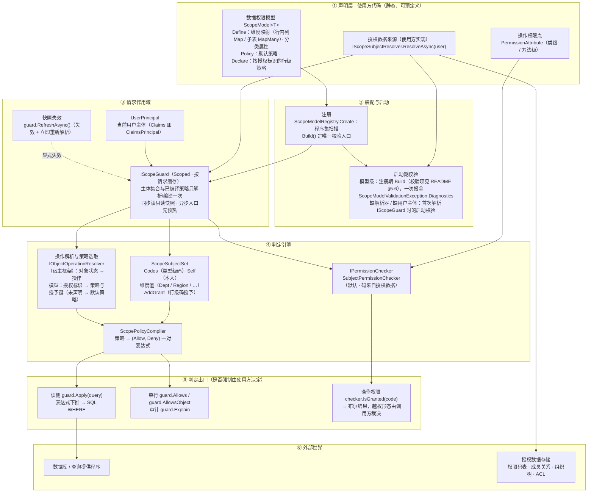

# Euonia.Security 权限体系设计说明

> 面向**维护者与评审者**的设计决策记录。使用说明见 [README.md](README.md)。

本文记录「为什么这样设计」，以及**被否决的方案**与**已知边界**。每条决策都给出它所解决的问题；
若没有那个问题，该决策就不成立，可以重新评估。

---

## 库边界

本库只依赖 `Euonia.Core` 与 `Microsoft.Extensions.DependencyInjection.Abstractions`
（`AddPermission` 这一注册入口所需），**不拦截任何调用**：它回答「能不能」，不回答「在哪里裁决」。
强制执行点由使用方决定。

**为什么要有两处接口**：权限要按「资源当前代表哪个业务操作」选策略，而
「资源类型 → 操作」的对应关系因框架而异（同一类型在不同框架下可能代表不同操作，
也可能一个操作对应多个方法）。若引擎直接去猜，就等于把某个宿主框架的类型体系写进引擎，
使引擎无法独立使用。因此这些判断定义成接口（契约都在 Core）：

| 接口 | 回答的问题 | 缺席时的行为 |
|---|---|---|
| `IPermissionCodeSource` | 「哪个方法对应哪个业务操作」 | 扫不到方法级权限码，故不存在方法级声明 |
| `IObjectOperationResolver` | 「这个资源实例当前代表哪个操作」 | 未显式给出操作的判定按默认策略（`ScopeKeys.Default`）判定 |
| `IScopeSubjectResolver` | 「当前用户的授权值是什么」 | 已声明模型或权限码时启动期报错 |

**为什么不提供默认实现**：一个「猜错」的默认实现比没有实现更糟——它会静默地把判定路由到
更宽松的策略上，且没有任何迹象。宁可让使用方显式回答。

`IObjectOperationResolver` 缺席时的回落在使用方显式传入操作的调用路径上是安全的：
写侧总是由调用方**显式传入操作**，状态推断只服务于未指定操作的单行判定。

---

## 0. 两条主线

权限体系分成两个互相独立又共享底座的部分：

| | 操作权限 | 数据权限 |
|---|---|---|
| 回答 | 当前用户**能否执行某项操作** | 当前用户**能看到/操作哪些数据行** |
| 粒度 | 类型级（`[Permission]`）+ 行级（策略按授权标识声明） | 行级 |
| 判定出口 | `IPermissionChecker` | `IScopeGuard`（读侧下推 + 单行判定） |

二者共享同一份**授权数据**（`ScopeSubjectSet`）与同一套**表达式引擎**，
由 `IScopeSubjectResolver` 一次解析、`IScopeGuard` 按请求缓存。

### 0.1 架构总览



读法（自上而下、自左向右）：

- **① 声明层**：能预定义的都写在这里。操作权限点（`PermissionAttribute`）与数据权限模型
  （`ScopeModel<T>`）由程序集扫描发现；授权数据来源 `IScopeSubjectResolver`
  由使用方实现，是**唯一**的数据入口。
- **② 装配与启动**：扫描 + 注册期校验一体完成，配置错误全部 fail-fast
  （保留前缀 §1.6、声明冲突 §1.7；启动期校验清单见 README §5.6）。
- **③ 请求作用域**：`IScopeGuard` 按请求缓存解析结果，读写路径共享同一份快照；
  同步读只读已解析快照（冷缓存报错），异步入口先预热；撤销生效于「下一次解析」
  （§1.8；缓存契约见 README §5.5）。
- **④ 判定引擎**：操作权限判定走 `IPermissionChecker`（码来自授权数据，§1.2）；
  数据权限把策略编译成 **一对表达式**（§1.3/§1.4），策略与授予键按授权标识的声明选取（§1.7）。
- **⑤ 判定出口**：读侧 `guard.Apply` 下推成 SQL `WHERE`（绝不烘进 EF 全局过滤器，
  该做法已被否决，见第 3 章）；单行 `Allows`/`Explain` 与查询共用同一棵表达式，
  结论不可能漂移。**本库不拦截任何调用**——在何处、以何种异常形态强制，是使用方的决定。
- **⑥ 外部世界**：授权数据与数据库都是使用方的，框架只消费解析结果与表达式树。

---

## 1. 核心决策

### 1.1 权限码是策略的键

**问题**：`[Permission]` 是类型级的——同一用户对同一类型的**所有行**权限相同。
真实场景需要「仓库 A1 可 push+delete、A2 仅可 push」。

**决策**：把数据权限的维度机制推广一层，`Grant(dimension)` 的语义从
「用户在该维度被授予的值」变为「用户**在该权限码下**于该维度被授予的值」。
行级操作权限因此成为「该码下的策略」，不需要引入任何新概念。

**收益**：行级权限直接获得表达式引擎的全部能力——可下推、可 deny、可审计、可组合。

**被否决的方案**：

| 方案 | 否决理由 |
|---|---|
| 行实现 ACL 接口（`IRowRights.GetRights(user)`） | 返回的是委托而非表达式，**无法下推**，列表查询做不了行级操作权限过滤；且与现有引擎是两套语义 |
| `Dictionary<code, ScopeSubjectSet>`（码级整体隔离） | 会让 `Self()`/`owner` 维度在码级集合存在时**静默失效**——本人删自己的数据被拒，且极难排查 |

### 1.2 操作权限不来自 Claims

**问题**：把权限码放在令牌的 `"permission"` 声明里有两个实际风险：

1. 权限码数量可能很大，**撑爆 Token**；
2. 更严重的是**取消授权后，旧令牌在过期前一直有效**——撤销不生效。

**决策**：权限码改由 `IScopeSubjectResolver` 从授权数据实时解析，随 `IScopeGuard` 按请求缓存。
读令牌 `"permission"` 声明的 `ClaimPermissionChecker` 已**删除**——这条回退路径与「撤销必须立即生效」
相悖；需要自定义判定数据的宿主自行实现 `IPermissionChecker`（在 `AddPermission` 之后 `AddScoped` 即可，见 README §4.4）。

**收益**：撤销只需改数据，下一次解析即生效，**不需要重新签发令牌**。
测试 `RevokedPermission_ShouldTakeEffectWithoutReissuingToken` 用一个
**不含任何 `permission` 声明的同一个 `ClaimsPrincipal`** 钉住这一点。

**保留的部分**：**角色仍来自声明**。角色数量少而稳定，不构成令牌膨胀；
且 `ClaimsIdentity.IsInRole` 是 BCL 能力。细粒度授权一律走权限码——README 明确禁止用角色承载。

### 1.3 单一真值来源：只有一对表达式

**问题**：数据权限有两个落点——查询过滤（排除行）与写侧判定（拒绝保存）。
若各写一套判定逻辑，二者必然漂移：查询放过了某行，写侧却拒绝；或反之，
**后者是安全漏洞**。这正是重写前那套设计最致命的问题（它只有内存过滤，
真正的 DB 过滤交给使用方手写 `IN (...)`，语义完全不受框架约束）。

**决策**：策略**只编译成一对表达式**，不存在第二套判定逻辑：

```
Allows(resource) ≡ Allow(resource) && !Deny(resource)
query            ≡ source.Where(Allow).Where(!Deny)
```

`Allows` 把**同一个** `Allow`/`Deny` 表达式 `Compile()` 后求值，下推则直接搬运表达式树。
两者在数学上不可能给出不同结论。回归护栏见
`ScopeTests.Pushdown_And_InMemoryEvaluation_ShouldAgree`。

**推论**：用户被授予的值在编译期被**烘进表达式**（`ids.Contains(x.DeptId)`），
因此编译结果与当次授权数据绑定——这正是「按请求缓存」这一设计的由来。

### 1.4 allow/deny 代数

每个 `ScopePolicy<T>` 归约为三元组 `(Allow, Deny, HasAllow)`：

| 策略 | Allow | Deny | HasAllow |
|---|---|---|---|
| `Grant(d)` | `ids.Contains(x.D)` | `false` | true |
| `Self()` / `Where(p)` | 同 `Grant(owner)` / `p` | `false` | true |
| `Deny(p)` | — | `p.Allow ∨ p.Deny` | **false** |
| `All(p…)` | `∧{pᵢ.Allow \| pᵢ.HasAllow}`（全无则 `true`） | `∨{pᵢ.Deny}` | 任一 |
| `Any(p…)` | `∨{pᵢ.Allow \| pᵢ.HasAllow}`（全无则 `false`） | `∨{pᵢ.Deny}` | 任一 |

**`HasAllow` 标志不可省**。若把 `Deny(p)` 的 Allow 记作 `true`，则
`Any(Grant("dept"), Deny(secret))` 会退化成 `Allow = true` ⇒「除机密外全放行」——
一个静默提权。用 `HasAllow` 把 deny-only 分支从 `Any` 的「或」里排除，才得到预期的
`dept ∧ ¬secret`。回归用例：`ScopeTests.Any_WithDenyOnlyBranch_ShouldNotDegradeToAllowAll`。

**Deny 一律上浮**（`All` 与 `Any` 同规则），等价于防火墙式「拒绝优先」。
代价是表达力稍弱（`Any` 分支里的 deny 也作用于整体），换来的是保守的安全默认。
这是**有意的取舍**，不是实现疏忽。

**`Deny` 是否决，不是布尔取反**。需要取反请用 `Where(x => !...)`。
`Deny(Deny(p))` 无意义，构造期直接抛异常拒绝。

### 1.5 层级在解析期展开

**问题**：部门树、组织树是常见需求，但框架若理解层级就无法下推成 `IN (...)`。

**决策**：层级由 `IScopeSubjectResolver` 在解析期展开为**扁平集合**，框架只看到集合。
判定与下推因此永远只是集合成员判断。

**代价**：解析器要做一次闭包展开，且授予集合可能很大（见 §2.3）。

### 1.6 保留命名空间与覆盖语义

三条硬规则，每条都对应一个具体的错误：

| 规则 | 不这样做会怎样 |
|---|---|
| 保留前缀 `@`（其中只有 `@default` 一个有意义的名字），不用字面量 `*` 作通配键 | `*` 在本仓已表示「权限码前缀通配」、也曾表示「维度值通配」。再加第三个含义会让排障变成猜谜 |
| 码级授予**覆盖**默认键，不做并集 | 默认授予会把某码上被收窄的行集合重新撑开，行级差异失效。用例：`RowLevel_CodeGrantShouldOverrideDefault_NotUnion` |
| 通配**不参与**维度查找 | 持有 `repo:*` 会顺带拿到 `(repo:*, repo)` 的授予，管理员无法把某个具体码收窄 |

**命名空间冲突在声明处拒绝**：标识与授予键共用一个命名空间——标识撞标识
（`IDS_SCOPE_POLICY_DUPLICATE_DECLARED`），键与任何已有名字相撞、标识撞上已有的键
（`IDS_SCOPE_KEY_DUPLICATE_DECLARED`），都在 `Declare` 处直接失败（注册期并入汇总诊断）——
共用名字等于共用同一份行级授予，改一个等于改另一个。
策略直接挂在标识上，「同一操作解析出多个有策略的码」与「声明了策略却无人寻址」这两种歧义
在结构上不可能出现，因此也不需要对应的校验。

### 1.7 授权标识是策略的身份，授予键来自声明

**问题**：判定入口要同时回答「用哪条策略」和「授予从哪读」。这两件事若受调用方状态影响，
就可能把同一变更路由到更宽松的策略或更宽的授予上。

**决策**：策略的身份是判定入口传入的**授权标识**（操作名或权限码），没有声明过的标识回落到
模型默认策略。「资源当前代表哪个操作」由宿主框架实现的 `IObjectOperationResolver` 回答（引擎只消费）；
「标识 → 策略 + 授予键」由模型注册项（`ScopeModelRegistration.TryResolve`）回答——先查声明的标识，
再查声明的**授予键**（键与标识共用命名空间），都没命中则用默认策略、以标识自身为键。
写侧判定与单行/下推判定共用这一条路径——各写一遍必然漂移，
而「一处按 Update 判、另一处按 Create 判」会让策略静默错位。

资源状态改变的是**实际执行的操作**，每条标识各自应用自己的策略，不存在越权通道。

授予键默认取标识自身、不落保留前缀：`@` 下写不进授予（`AddGrant` 拒绝保留键），
派生键只会让这条策略的授予永远取不到；以自身为键则宿主在 `approve` 这类操作下写的授予会被读到。

同一模型内两条声明占用同一个名字（标识或键，任意方向）→ 在 `Declare` 处失败，不允许靠猜。

### 1.8 缓存失效不可被在途解析回滚

**问题**：授权数据按请求缓存（`ScopeGuard`），解析是异步查库。若「解析进行中」时发生失效
（典型场景：刚撤销完授权，显式刷新），而在途的那次解析读到的是**撤销前**的数据，
它返回后若无条件发布，就会把刚做的失效覆盖掉——**一次撤销被静默回滚**。这是一条真实的安全缺口，
且只在竞态下出现，靠常规测试发现不了。

**决策**：解析闸门（`SemaphoreSlim`）把解析与重新解析串行化，使并发的首次访问只真正解析一次
（兑现「每请求只解析一次」的承诺），并让「失效」与「在途解析」不可能交错——上述竞态
**在结构上不存在**。失效入口只有 `RefreshAsync()`，它把「失效」与「立即重新解析」合成一步，
不再留下「已失效、尚未解析」的空窗。

失效代数（`_version`）只剩一个用途：编译在闸门之外进行（`ScopeGuard.GetPolicy`），
若编译期间发生过一次重新解析，本次基于旧授权数据算出的策略不得写回缓存——
否则撤销会在本作用域内被静默回滚。

**回归护栏**：`Refresh_WhileAResolveIsInFlight_ShouldWinAfterItCompletes`（`ScopeTests`）
用可控时机的解析器精确构造该竞态。

### 1.9 子表维度：关系表作为取值来源

**问题**：「用户属于哪些团队」这类授权关系常常不在资源行上，而在**子表**里
（`team_member(team_id, user_id, status)`）。维度取值只能取自资源行时，只剩解析器反向展开一条路
（§2.1）：关系表与授权数据必须互相同步，每次解析多一次反查与一个 `IN (...)`，
且关系的属性（`status`、`expires_at`）无法参与行级判定，只能塌缩成解析期的一次性快照。

**决策**：把维度取值从「单值」推广为「集合」，`Grant(d)` 的语义统一为
**「资源在该维度上的取值集合 ∩ 用户被授予的集合 ≠ ∅」**（单值是退化情形，语义不变）。
集合值由 `MapMany` 声明，编译成 `x.Members.Where(f).Any(v => values.Contains(v.UserId))`，
即提供程序翻译为 `EXISTS` 相关子查询的形状；`Deny` 之下则是 `NOT EXISTS`。

**收益**：

- 关系表成为**唯一真值来源**——不必把成员关系镜像进授权数据，成员增减下一次查询即生效；
- 授予的值从「资源 id 列表」变为「用户自己的标识」（通常一个元素），`IN` 列表不再随关系规模增长；
- 子表属性由数据库实时求值，而不是解析期快照；
- 策略代数、策略键、审计、启动期校验**全部复用**——本决策只扩展「取值来源」，不扩展策略语言。

**代价**：单行判定要求对象图完整（§2.5）；取值形状只支持一种（见下）。

**被否决的方案**：

| 方案 | 否决理由 |
|---|---|
| 原样保留选择器，把 `Any(Select(...))` 丢给提供程序翻译 | 「对投影结果求 `Any`」能否翻译取决于提供程序与版本，可下推性不该押在猜测上。改为在**注册期分解**选择器，只产出确定可翻译的那一种形状；不可分解即启动失败——与其在查询时报翻译失败，不如在启动时说清楚 |
| 让 `Where` 的谓词引用当前用户 / 授权集合 | 逃逸口过大：授权值会从 `IScopeSubjectResolver` 之外的来源进入策略，撤销语义与 fail-closed 都不再可保证 |
| 支持「子行全部命中」（∀ 量词） | 判定语义始终是集合成员判断；引入量词等于把表达式引擎推向通用 DSL（第 3 章已否决） |
| 引擎回查数据库补齐子集合 | 引擎没有数据访问（库边界），且会把 I/O 带进判定 |
| 只保留解析器反向展开、把子表场景写进文档 | 关系表越大越糟，且它逼迫每个宿主把关系**镜像**成授权数据。反向展开仍有它的位置（跨库、授组收窄，见 §2.1），但不该是唯一路径 |

---

### 1.10 规则以「配置」形态声明，但校验仍在注册处

**问题**：若注册调用要求使用方先**构造**一个来源对象（`OperationCodeSource.Create()…Build()`）再传进来，
会带来两个实际后果：

1. 它看起来像「注册引擎服务」，于是被当成一次性调用；而它的载荷其实是**业务配置**
   （「哪个方法对应哪个操作」）——配置与注册绑在一起，配置本身却无处安放；
2. 模块化应用里，每个模块想贡献自己的操作入口约定时，只能「自己造一个来源」或「共享一个来源实例」，
   README §3.2 的合并语义因此显得多余。

**决策**：规则成为注册调用**接受的配置**——`AddPermission(o => o.Scan(assemblies).OnAttributeOrName(…))`（回调）
或回调内 `Source(...)` 指定自定义 `IPermissionCodeSource`。两种载体产出**同一套规则**
（同一份编译、同一份注册期校验、同一套合并），可混用并取并集。

**收益**：

- 一次注册调用即可「声明规则 + 注册引擎」，模块各自贡献并自动合并；
- **配置错误仍在注册处抛出**：回调在注册处编译，不推迟到容器构建或首次判定；
- 载体选择成为显式取舍：规则放代码（推荐），或放别处（自定义来源）。

**被否决的方案**：

| 方案 | 否决理由 |
|---|---|
| `services.ConfigurePermissionRules(...)` 之类的分离式注册 | 配置可能被遗忘（注册了引擎却没声明规则），且校验被推迟到容器构建——本库的既有性质是「配置错误在注册处抛出」，这条不能为了形态好看而放弃 |
| `IOptions<T>` / `Configure<T>` 延迟绑定 | 同上：容器构建期才报错；且多次调用的合并顺序不再由调用方决定 |
| 保留一个接收「构造好的来源对象」的 `AddPermission` 重载 | 看似是「规则既不在代码也不在配置里」（例如来自数据库）的唯一出口；实际上回调内的 `Source(...)` 已覆盖同一出口，多留一个重载只会让来源有两种形态、合并语义多一条分叉 |
| 配置节载体（`AddPermission(configuration.GetSection(…), assemblies)` 与 `ConfigurationRuleBinder`） | 它把鉴权口径搬进可被部署改动的地方——把某个方法从「需要审批码」改成「无码」只是一次配置改动；表达力也小于回调（只能承载类型名 + 方法名），且会给本库引入 `Microsoft.Extensions.Configuration.Abstractions` 依赖。规则来自配置的宿主应实现 `IPermissionCodeSource` 自定义来源：出口保留，形态统一 |

---

### 1.11 运行期判定与注册期校验用同一个来源

**问题**：宿主框架的运行期判定（操作权限闸门、数据权限的策略选取）若直接使用它自己的约定来源，
而注册期校验用的是容器里注册的 `IPermissionCodeSource`（宿主补充的规则都在里面），两者就会分叉——
后果是：宿主通过回调 / 自定义来源补充的规则**只在启动期生效**，被它识别为入口的方法上的
`[Permission]` 不进判定、为该码声明的行级策略不生效、判定退回默认策略，而启动期**不报错**。
表现为「闸门比配置写的更宽松」，正是本库最不能接受的一类失败。

**决策**：运行期与注册期问**同一个来源**。为此：

- 「要求」并入 `IPermissionCodeSource`（Core）：`RequirementsFor` 是它的成员，默认实现把权限码折算成
  「有码、无角色」——把只给码的来源的码整个丢掉会让闸门比来源本身更宽松，而角色要求本就不在这类来源的
  表达力之内（能表达角色的实现覆写它即可）；
- 合并来源对每个成员取要求并去重，不再需要「能回答要求的来源」这类能力判定；
- 宿主框架的运行期从容器解析该来源（宿主本身不引用引擎：契约在 Core，模型注册表由宿主用
  `AddPermission` 注册），来源缺席或回答不了要求时回落到宿主自己的约定来源。

**收益**：宿主的补充规则在运行期同样生效（与宿主自己的约定来源取并集）；
注册期校验与操作权限闸门两处对「某操作解析到哪些要求」不可能得出不同答案。
策略的选取则完全与来源无关——它按**授权标识**进行，授予键来自模型声明，没有去问来源的解析层。

**回归护栏**：`Factory_Boundary_Should_Reject_When_Host_Declared_Requirement_Is_Missing`——
一旦宿主规则在运行期被忽略，该用例即报「没有抛出异常」而转红。

**被否决的方案**：

| 方案 | 否决理由 |
|---|---|
| 宿主的判定只查容器里的 `IPermissionCodeSource.CodesFor` | 它回答不了角色，会把「带角色要求」的规则降级成只看权限码 |
| 两个来源各自查询、结果在调用点取并集 | 并集与去重会散落到每个调用点；「谁先谁后」成为新的分叉点，合并逻辑应当只有一处 |
| 不修，只在文档里写清楚 | 这是一条 fail-open 的静默路径，与「配置写了却不生效」等价；文档不能替代修复 |

## 2. 已知边界与取舍

这些是**有意接受**的限制，不是待办事项。使用方需要知道它们。

### 2.1 行级 ACL 仍要求解析器做反向展开

行级策略的形式是 `Grant("repo")` ⇒ `repoIds.Contains(x.RepoId)`，
即解析器必须回答「此用户在此码下能碰**哪些资源 id**」。

若 ACL 是正向存储的（「哪些用户能 push 到 A1」），解析器要把它翻成 id 列表，
得到的是巨型 `IN (...)` + 每请求成本。

**这条边界的适用范围已被 §1.9 收窄**：关系在同库、且关系行可枚举时（成员表 / 关系表），
改用子表维度即可下推成 `EXISTS`，不必反向展开。反向展开仍适用于：
关系在别处（跨库 / 外部授权服务）、或需要把授予集合**收窄**成「组 id 而非行 id」的场合。
行数巨大且关系极稀疏时，仍有逃生舱 `Where(x => aclQuery.Contains(x.Id))`，成本自行评估。

### 2.2 注册表不参与按类型的进程级缓存

`ScopeModelRegistry` 是**按容器**的实例而非进程级静态状态，因此不同的容器与测试之间天然隔离，
无需考虑跨容器复用带来的授权泄漏。代价是每次启动都要重新扫描并校验程序集——
但这只是一次性成本，且换来的是可测试性。

### 2.3 角色仍受令牌时效约束

角色来自声明，因此**角色的撤销仍需等令牌过期**（这与权限码不同）。
所以：细粒度授权一律用权限码；角色只用于粗粒度、稳定的人员分类。

### 2.4 维度选择器的值类型固定为 `string`

`Expression<Func<T,string>>` 是 `IN` 下推最自然的载体，但真实系统里 `TeamId` 常为 `Guid`/`long`。
当前只能把列声明为字符串（或提供一个字符串投影）。扩展到泛型值类型会显著增加编译复杂度与校验面，
暂不做。子表维度（§1.9）同理：`MapMany` 的元素取值也必须是字符串。

### 2.5 子表维度的单行判定要求对象图完整

内存判定（`Allows` / `AllowsObject` / `Filter` / `Explain`，以及宿主的对象边界）在**实例上**求值，
而集合维度的取值来自子集合：子集合未加载（空引用）时判定不了，框架抛
`InvalidOperationException` 并指明维度、路径与三条修法。这是**有意的**——
静默判为拒绝会把「没加载」伪装成「无权限」，在写侧表现为合法用户被拒且毫无线索。

探测粒度是**编译后的策略**而非模型：只有「本策略确实 `Grant` 了某个子表维度」时才要求对应的子集合。
这不是优化，而是让取舍可落地——同一资源可以把读侧策略写成子表维度（EXISTS、实时），
写侧策略写成行内列（如 `Grant(owner)`，不要求对象图），各自取各自的长处。

探测在求值**之前**执行，因此「策略本来就会短路到某个结论」也照样报错：
结论若建立在没加载的数据上，本身就是错的。探测表达式只用于内存判定，
下推路径（`Apply`）**不做**任何探测——查询由数据库求值，与 CLR 对象图无关。

有一处**无法检测**的残余：实体把集合初始化成空集合（`public List<Member> Members { get; set; } = [];`）时，
「未加载」与「确实没有成员」不可区分，于是表现为静默拒绝。这属于应用自己的对象图约定，
框架无从判断——去掉初始化器即可让它报错。

### 2.6 子表维度只有存在量词

「子行**全部**命中」这类全称量词不支持（见 §1.9 被否决的方案）。
需要这类语义时，应把它建模成另一个维度或另一个资源，而不是给策略语言加量词。

### 2.7 子表维度把关系表的写入口变成授权面

成员关系一旦参与判定，`team_member` 的增删改就等同于授权变更——**该表的写入口必须由操作权限把守**，
否则「给自己加一行」就是一次提权。这是子表维度的固有性质，不是实现缺陷：
它同时是收益（撤销即时生效、无需同步）与责任（写入面即授权面）。

---

## 3. 被否决的方案

| 方案 | 否决理由 |
|---|---|
| **EF 全局查询过滤器**（`HasQueryFilter`/`SetQueryFilter`）做读侧强制 | EF 的模型（含全局过滤器）**按 DbContext 类型缓存**，而 `Allow`/`Deny` 捕获了每用户不同的集合常量，一旦烘进缓存模型就会被跨请求复用——**数据泄漏**。本仓既有的 `SetTombstoneQueryFilter` 之所以安全，只是因为它过滤的是常量 `!IsDeleted` |
| **通用表达式 DSL**（策略写成字符串再解析，类似 Rego） | 会引入解析器 + 求值器 + 翻译器三份实现，正是本设计要消灭的漂移源 |
| **同步的解析器接口** | 解析器必然查库；同步签名会把同步 I/O 带进请求链路。用 `ValueTask` + 单次解析已足够 |
| **引用 `Euonia.Linq` 复用表达式组合子** | 其承重的 `ParameterRebinder` 是 `internal`，外部用不上；且 `Source/` 下没有任何项目在用该组合子。为三个方法引入 ProjectReference 不划算，改为 25 行的内部参数替换 + body 层归并 |
| **在注册服务的过程中直接检查解析器是否已注册** | 解析器通常在那之后才注册，在那里检查会误报。改为在注册时记录状态（内部的注册登记），由首次解析 `IScopeGuard` 时的启动校验检查 |
| **保留一个读令牌声明的 `ClaimPermissionChecker`**（默认实现之外的备选） | 「读令牌」这条回退路径与「撤销必须立即生效」相悖：权限码固化在令牌里，过期前无法撤销。自定义需求由宿主自建 `IPermissionChecker` 承接即可，见 §1.2 |

---

## 4. 回归护栏

以下测试不是覆盖率填充，而是**钉住上面每一条决策**。改动若让它们转红，说明决策被无意推翻了：

| 测试 | 钉住的决策 |
|---|---|
| `Pushdown_And_InMemoryEvaluation_ShouldAgree` | §1.3 单一真值来源 |
| `Apply_ShouldProduceExpressionBasedWhere_NotEnumerableWhere` | §1.3 可下推（是表达式而非委托） |
| `Any_WithDenyOnlyBranch_ShouldNotDegradeToAllowAll` | §1.4 `HasAllow` 不可省 |
| `Any_OfOnlyDenyBranches_ShouldDenyEverything` | §1.4 fail-closed |
| `Deny_ShouldOverrideGrant_EvenInNestedAny` | §1.4 deny 上浮 |
| `EmptySubjects_ShouldProduceConstantFalse_NotEmptyIn` | §1.4 不生成空 `IN ()` |
| `RowLevel_SameUserSameType_DifferentRowsDifferentRights` | §1.1 行级权限 |
| `RowLevel_CodeGrantShouldOverrideDefault_NotUnion` | §1.6 覆盖而非并集 |
| `RevokedPermission_ShouldTakeEffectWithoutReissuingToken` | §1.2 撤销立即生效 |
| `Permissions_ShouldComeFromResolver_NotClaims` | §1.2 权限码不来自令牌 |
| `GuardResolution_ShouldFailWhenResolverMissing` | §3 启动期校验 |
| `Refresh_WhileAResolveIsInFlight_ShouldWinAfterItCompletes` | §1.8 缓存失效不可被回滚（解析闸门串行化） |
| `PolicySet_ShouldRejectReservedScopeKey` / `PolicySet_ShouldAllowFrameworkDefaultKeys` / `PolicySet_ShouldRejectDuplicateOperation` | §1.6 保留命名空间；§1.7 一个标识一个声明位 |
| `Declared_Grant_Key_Should_Be_Addressable_As_An_Identifier` / `Identifier_And_Grant_Key_Should_Share_One_Namespace` / `For_Should_Declare_A_Code_As_Both_Identifier_And_Grant_Key` | §1.7 标识与授予键共用命名空间；按码声明等价于按操作声明并指定同名键 |
| `AddPermission_Should_Key_Execute_From_Model_Declaration` / `_From_Operation_When_Model_Declares_None` / `_Not_Key_Declared_Operation_From_Other_Declarations` | §1.7 键随声明给出（未声明则以标识自身为键） |
| `AddCode_Should_Reject_Reserved_Namespace` | §1.6 保留命名空间（授权数据这一侧同样不得携带保留码） |
| `Allows_And_AllowsObject_Should_Agree_For_Proxy_Instance` | §1.3 两个单行判定入口对同一实例结论一致；派生/代理实例不得 fail-open |
| `MapMany_ShouldCompileTo_AnyOverContains_NotProjectedAny` / `MapMany_UnsupportedShape_ShouldFail_AtRegistration` | §1.9 只产出确定可下推的形状，其余在注册期拒绝 |
| `MapMany_Pushdown_And_InMemoryEvaluation_ShouldAgree` | §1.3 单一真值来源（子表维度同样成立） |
| `MapMany_UnloadedCollection_ShouldFailLoudly_WithDimensionAndFix` | §2.5 判定不了就失败，绝不静默拒绝 |
| `MapMany_CollectionInitializedToEmpty_ShouldBeDeniedSilently` | §2.5 已知边界：初始化为空集合时静默拒绝——**有意保留**，不要改成放行 |
| `MapMany_DenyOnlyInsideAny_ShouldStillDenyEverything` | §1.4 fail-closed（子表维度同样适用） |
| `MapMany_Apply_ShouldTranslateTo_Exists_Subquery` / `MapMany_Apply_ForDeclaredKey_ShouldTranslateTo_NotExists`（EF Core + SQLite） | §1.9 可下推：真实提供程序必须产出 `EXISTS` / `NOT EXISTS` |
| `MapMany_Sqlite_ShouldAgree_With_InMemory` | §1.3 下推与内存判定一致（真实提供程序，非 LINQ-to-Objects） |
| `Callback_Should_Declare_Rules_Inline` / `Callbacks_From_Different_Modules_Should_Merge` / `Callback_And_Custom_Source_Should_Merge` | §1.10 回调载体与自定义来源的并集合并 |
| `Callback_Without_Rules_Should_Fail_At_Registration` | §1.10 忘了给规则必须是错误，不是静默放行 |
| `Merged_Sources_Should_Expose_Requirements_From_Every_Source` | §1.11 合并来源能回答「要求」（含角色）；只给码的来源折算为「有码、无角色」 |
| `Factory_Boundary_Should_Reject_When_Host_Declared_Requirement_Is_Missing` | §1.11 运行期与注册期用同一个来源——宿主规则一旦被忽略即转红 |

> 配置节载体、`IScopeKeyResolver` 解析层与死策略/歧义校验被删除时，钉住它们的用例
> （`Configuration_*`、`ValidateKeyResolution` 等）随各自被替换的结构一并删除；
> 「在途解析」那条竞态用例改为 `Refresh_WhileAResolveIsInFlight_ShouldWinAfterItCompletes`
> （语义从「失效打断在途解析」变为「刷新排在在途解析之后」）——本表只列**当前存在**的护栏。
