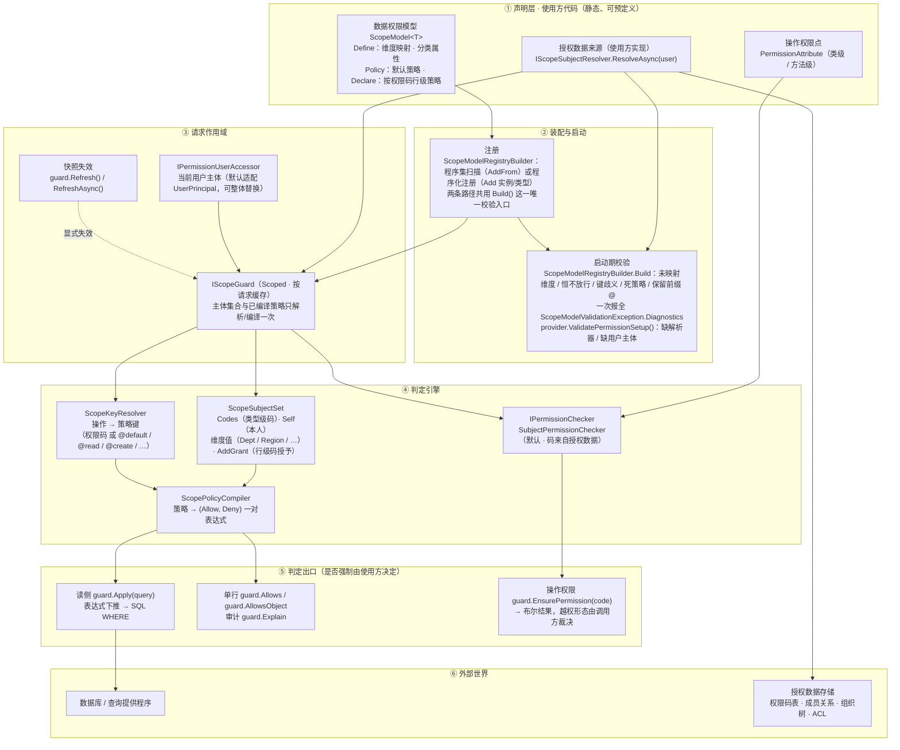

# Euonia.Security 权限体系设计说明

> 面向**维护者与评审者**的设计决策记录。使用说明见 [README.md](README.md)。

本文记录「为什么这样设计」，以及**被否决的方案**与**已知边界**。每条决策都给出它所解决的问题；
若没有那个问题，该决策就不成立，可以重新评估。

---

## 库边界

本库只依赖 `Euonia.Core`，**不拦截任何调用**：它回答「能不能」，不回答「在哪里裁决」。
强制执行点由使用方决定。

**为什么要有两处接口**：权限要按「资源当前代表哪个业务操作」选策略键，而
「资源类型 → 操作」的对应关系因框架而异（同一类型在不同框架下可能代表不同操作，
也可能一个操作对应多个方法）。若引擎直接去猜，就等于把某个宿主框架的类型体系写进引擎，
使引擎无法独立使用。因此引擎把这些判断定义成接口：

| 接口 | 回答的问题 | 缺席时的行为 |
|---|---|---|
| `IPermissionCodeSource` | 「哪个方法对应哪个业务操作」 | 扫不到方法级权限码，故不存在方法级声明 |
| `IScopeKeyResolver` | 「这个资源实例当前代表哪个操作」 | 未显式指定权限码的判定回落到 `ScopeKeys.Default` |
| `IScopeSubjectResolver` | 「当前用户的授权值是什么」 | 已声明模型或权限码时启动期报错 |
| `IPermissionUserAccessor` | 「当前是谁」 | 默认适配 `UserPrincipal`；皆无即未认证，全部拒绝 |

**为什么不提供默认实现**：一个「猜错」的默认实现比没有实现更糟——它会静默地把键路由到
更宽松的策略上，且没有任何迹象。宁可让使用方显式回答。

`IScopeKeyResolver` 缺席时的回落在使用方显式传入权限码的调用路径上是安全的：
写侧总是由调用方**显式传入操作或权限码**，状态推断只服务于未指定权限码的行内断言。

---

## 0. 两条主线

权限体系分成两个互相独立又共享底座的部分：

| | 操作权限 | 数据权限 |
|---|---|---|
| 回答 | 当前用户**能否执行某项操作** | 当前用户**能看到/操作哪些数据行** |
| 粒度 | 类型级（`[Permission]`）+ 行级（按权限码的策略） | 行级 |
| 判定出口 | `IPermissionChecker` | `IScopeGuard`（读侧下推 + 单行判定） |

二者共享同一份**授权数据**（`ScopeSubjectSet`）与同一套**表达式引擎**，
由 `IScopeSubjectResolver` 一次解析、`IScopeGuard` 按请求缓存。

### 0.1 架构总览



读法（自上而下、自左向右）：

- **① 声明层**：能预定义的都写在这里。操作权限点（`PermissionAttribute`）与数据权限模型
  （`ScopeModel<T>`）由程序集扫描发现；授权数据来源 `IScopeSubjectResolver`
  由使用方实现，是**唯一**的数据入口。
- **② 装配与启动**：扫描 + 注册期校验一体完成，配置错误全部 fail-fast
  （键歧义 §1.7、保留前缀 / 死策略 §1.6；启动期校验清单见 README §5.6）。
- **③ 请求作用域**：`IScopeGuard` 按请求缓存解析结果，读写路径共享同一份快照，
  撤销生效于「下一次解析」（§1.9；缓存契约见 README §5.5）。
- **④ 判定引擎**：操作权限判定走 `IPermissionChecker`（码来自授权数据，§1.2）；
  数据权限把策略编译成 **一对表达式**（§1.3/§1.4），键只由操作决定（§1.7）。
- **⑤ 判定出口**：读侧 `guard.Apply` 下推成 SQL `WHERE`（绝不烘进 EF 全局过滤器，
  该做法已被否决，见第 3 章）；单行 `Allows`/`Explain` 与查询共用同一棵表达式，
  结论不可能漂移。**本库不拦截任何调用**——在何处、以何种异常形态强制，是使用方的决定。
- **⑥ 外部世界**：授权数据与数据库都是使用方的，框架只消费解析结果与表达式树。

---

## 1. 核心决策

### 1.1 权限码是策略的键

**问题**：`[Permission]` 是类型级的——同一用户对同一类型的**所有行**权限相同。
真实场景需要「仓库 A1 可 push+delete、A2 仅可 push」。

**决策**：把数据权限的维度机制推广一层，`Grant(dimension)` 的语义从
「用户在该维度被授予的值」变为「用户**在该权限码下**于该维度被授予的值」。
行级操作权限因此成为「该码下的策略」，不需要引入任何新概念。

**收益**：行级权限直接获得表达式引擎的全部能力——可下推、可 deny、可审计、可组合。

**被否决的方案**：

| 方案 | 否决理由 |
|---|---|
| 行实现 ACL 接口（`IRowRights.GetRights(user)`） | 返回的是委托而非表达式，**无法下推**，列表查询做不了行级操作权限过滤；且与现有引擎是两套语义 |
| `Dictionary<code, ScopeSubjectSet>`（码级整体隔离） | 会让 `Self()`/`owner` 维度在码级集合存在时**静默失效**——本人删自己的数据被拒，且极难排查 |

### 1.2 操作权限不来自 Claims

**问题**：把权限码放在令牌的 `"permission"` 声明里有两个实际风险：

1. 权限码数量可能很大，**撑爆 Token**；
2. 更严重的是**取消授权后，旧令牌在过期前一直有效**——撤销不生效。

**决策**：权限码改由 `IScopeSubjectResolver` 从授权数据实时解析，随 `IScopeGuard` 按请求缓存。
`ClaimPermissionChecker` 保留但标记 `[Obsolete]`、不再是默认实现。

**收益**：撤销只需改数据，下一次解析即生效，**不需要重新签发令牌**。
测试 `RevokedPermission_ShouldTakeEffectWithoutReissuingToken` 用一个
**不含任何 `permission` 声明的同一个 `ClaimsPrincipal`** 钉住这一点。

**保留的部分**：**角色仍来自声明**。角色数量少而稳定，不构成令牌膨胀；
且 `ClaimsIdentity.IsInRole` 是 BCL 能力。细粒度授权一律走权限码——README 明确禁止用角色承载。

### 1.3 单一真值来源：只有一对表达式

**问题**：数据权限有两个落点——查询过滤（排除行）与写侧判定（拒绝保存）。
若各写一套判定逻辑，二者必然漂移：查询放过了某行，写侧却拒绝；或反之，
**后者是安全漏洞**。这正是重写前那套设计最致命的问题（它只有内存过滤，
真正的 DB 过滤交给使用方手写 `IN (...)`，语义完全不受框架约束）。

**决策**：策略**只编译成一对表达式**，不存在第二套判定逻辑：

```
Allows(resource) ≡ Allow(resource) && !Deny(resource)
query            ≡ source.Where(Allow).Where(!Deny)
```

`Allows` 把**同一个** `Allow`/`Deny` 表达式 `Compile()` 后求值，下推则直接搬运表达式树。
两者在数学上不可能给出不同结论。回归护栏见
`ScopeTests.Pushdown_And_InMemoryEvaluation_ShouldAgree`。

**推论**：用户被授予的值在编译期被**烘进表达式**（`ids.Contains(x.DeptId)`），
因此编译结果与当次授权数据绑定——这正是「按请求缓存」这一设计的由来。

### 1.4 allow/deny 代数

每个 `ScopePolicy<T>` 归约为三元组 `(Allow, Deny, HasAllow)`：

| 策略 | Allow | Deny | HasAllow |
|---|---|---|---|
| `Grant(d)` | `ids.Contains(x.D)` | `false` | true |
| `Self()` / `Where(p)` | 同 `Grant(owner)` / `p` | `false` | true |
| `Deny(p)` | — | `p.Allow ∨ p.Deny` | **false** |
| `All(p…)` | `∧{pᵢ.Allow \| pᵢ.HasAllow}`（全无则 `true`） | `∨{pᵢ.Deny}` | 任一 |
| `Any(p…)` | `∨{pᵢ.Allow \| pᵢ.HasAllow}`（全无则 `false`） | `∨{pᵢ.Deny}` | 任一 |

**`HasAllow` 标志不可省**。若把 `Deny(p)` 的 Allow 记作 `true`，则
`Any(Grant("dept"), Deny(secret))` 会退化成 `Allow = true` ⇒「除机密外全放行」——
一个静默提权。用 `HasAllow` 把 deny-only 分支从 `Any` 的「或」里排除，才得到预期的
`dept ∧ ¬secret`。回归用例：`ScopeTests.Any_WithDenyOnlyBranch_ShouldNotDegradeToAllowAll`。

**Deny 一律上浮**（`All` 与 `Any` 同规则），等价于防火墙式「拒绝优先」。
代价是表达力稍弱（`Any` 分支里的 deny 也作用于整体），换来的是保守的安全默认。
这是**有意的取舍**，不是实现疏忽。

**`Deny` 是否决，不是布尔取反**。需要取反请用 `Where(x => !...)`。
`Deny(Deny(p))` 无意义，构造期直接抛异常拒绝。

### 1.5 层级在解析期展开

**问题**：部门树、组织树是常见需求，但框架若理解层级就无法下推成 `IN (...)`。

**决策**：层级由 `IScopeSubjectResolver` 在解析期展开为**扁平集合**，框架只看到集合。
判定与下推因此永远只是集合成员判断。

**代价**：解析器要做一次闭包展开，且授予集合可能很大（见 §2.3）。

### 1.6 保留命名空间与覆盖语义

三条硬规则，每条都对应一个具体的错误：

| 规则 | 不这样做会怎样 |
|---|---|
| 保留前缀 `@`（`@default`/`@read`/…），不用字面量 `*` 作通配键 | `*` 在本仓已表示「权限码前缀通配」、也曾表示「维度值通配」。再加第三个含义会让排障变成猜谜 |
| 码级授予**覆盖**默认键，不做并集 | 默认授予会把某码上被收窄的行集合重新撑开，行级差异失效。用例：`RowLevel_CodeGrantShouldOverrideDefault_NotUnion` |
| 通配**不参与**维度查找 | 持有 `repo:*` 会顺带拿到 `(repo:*, repo)` 的授予，管理员无法把某个具体码收窄 |

**依据这三条做启动期校验**：同一操作解析出多个有策略的码 → 失败；
声明了策略却没有任何操作会解析到该码（死策略）→ 失败。后者专治
「`Declare` 里的码与方法上 `[Permission]` 的码拼写对不上」——
那种情况下行级策略会静默失效、回落到默认策略，**很可能比作者本意更宽松**。

### 1.7 策略键只由操作决定

**问题**：键若受调用方状态影响，就可能把同一变更路由到更宽松的键。

**决策**：键只由**操作**决定；「资源当前代表哪个操作」由 `IScopeKeyResolver` 回答，
「按操作取键」由 `ScopeKeyResolver.Resolve` 回答。写侧判定与单行/下推判定共用这一条路径——
各写一遍必然漂移，而「一处按 Update 判、另一处按 Create 判」会让策略键静默错位。

资源状态改变的是**实际执行的操作**，每个操作各自应用自己的策略，不存在越权通道。

同一操作若解析出多个「声明了策略」的权限码 → 启动期失败，不允许靠猜。

### 1.8 缓存失效不可被在途解析回滚

**问题**：授权数据按请求缓存（`ScopeGuard`），解析是异步查库。若「解析进行中」时发生
`Refresh()`（典型场景：刚撤销完授权，显式失效），而在途的那次解析读到的是**撤销前**的数据，
它返回后若无条件发布，就会把刚做的失效覆盖掉——**一次撤销被静默回滚**。这是一条真实的安全缺口，
且只在竞态下出现，靠常规测试发现不了。

**决策**：引入失效代数（`_version`）。每次失效自增；解析开始时记下代数，发布前比对，
不一致就丢弃结果并重来。另用 `SemaphoreSlim` 串行化解析，使并发的首次访问只真正解析一次，
兑现「每请求只解析一次」的承诺。

**回归护栏**：`Refresh_DuringInFlightResolve_ShouldNotBeUndoneByStaleSnapshot` 用可控时机的
解析器精确构造该竞态——**关掉版本校验它就会转红**（已验证）。

---

## 2. 已知边界与取舍

这些是**有意接受**的限制，不是待办事项。使用方需要知道它们。

### 2.1 行级 ACL 要求解析器做反向展开

行级策略的形式是 `Grant("repo")` ⇒ `repoIds.Contains(x.RepoId)`，
即解析器必须回答「此用户在此码下能碰**哪些资源 id**」。

若 ACL 是正向存储的（「哪些用户能 push 到 A1」），解析器要把它翻成 id 列表，
得到的是巨型 `IN (...)` + 每请求成本；编译器目前只支持 `Constant(List<string>)` 形态，
无法下推子查询。

**守则**：授权尽量授「组 id」而非「行 id」；行数巨大时改用
`Where(x => aclQuery.Contains(x.Id))` 逃生舱并自行评估成本。

### 2.2 注册表不参与按类型的进程级缓存

`ScopeModelRegistry` 是**按容器**的实例而非进程级静态状态，因此不同的容器与测试之间天然隔离，
无需考虑跨容器复用带来的授权泄漏。代价是每次启动都要重新扫描并校验程序集——
但这只是一次性成本，且换来的是可测试性。

### 2.3 角色仍受令牌时效约束

角色来自声明，因此**角色的撤销仍需等令牌过期**（这与权限码不同）。
所以：细粒度授权一律用权限码；角色只用于粗粒度、稳定的人员分类。

### 2.4 维度选择器的值类型固定为 `string`

`Expression<Func<T,string>>` 是 `IN` 下推最自然的载体，但真实系统里 `TeamId` 常为 `Guid`/`long`。
当前只能把列声明为字符串（或提供一个字符串投影）。扩展到泛型值类型会显著增加编译复杂度与校验面，
暂不做。

---

## 3. 被否决的方案

| 方案 | 否决理由 |
|---|---|
| **EF 全局查询过滤器**（`HasQueryFilter`/`SetQueryFilter`）做读侧强制 | EF 的模型（含全局过滤器）**按 DbContext 类型缓存**，而 `Allow`/`Deny` 捕获了每用户不同的集合常量，一旦烘进缓存模型就会被跨请求复用——**数据泄漏**。本仓既有的 `SetTombstoneQueryFilter` 之所以安全，只是因为它过滤的是常量 `!IsDeleted` |
| **通用表达式 DSL**（策略写成字符串再解析，类似 Rego） | 会引入解析器 + 求值器 + 翻译器三份实现，正是本设计要消灭的漂移源 |
| **同步的解析器接口** | 解析器必然查库；同步签名会把同步 I/O 带进请求链路。用 `ValueTask` + 单次解析已足够 |
| **引用 `Euonia.Linq` 复用表达式组合子** | 其承重的 `ParameterRebinder` 是 `internal`，外部用不上；且 `Source/` 下没有任何项目在用该组合子。为三个方法引入 ProjectReference 不划算，改为 25 行的内部参数替换 + body 层归并 |
| **在注册服务的过程中直接检查解析器是否已注册** | 解析器通常在那之后才注册，在那里检查会误报。改为记录 `PermissionSetup`，由容器构建后的 `ValidatePermissionSetup()` 检查 |
| **删除 `ClaimPermissionChecker`** | 它是已发布的公开 API。改为保留 + `[Obsolete]` + 不再是默认实现——同等达成「默认路径不依赖令牌」，且不破坏使用方 |

---

## 4. 回归护栏

以下测试不是覆盖率填充，而是**钉住上面每一条决策**。改动若让它们转红，说明决策被无意推翻了：

| 测试 | 钉住的决策 |
|---|---|
| `Pushdown_And_InMemoryEvaluation_ShouldAgree` | §1.3 单一真值来源 |
| `Apply_ShouldProduceExpressionBasedWhere_NotEnumerableWhere` | §1.3 可下推（是表达式而非委托） |
| `Any_WithDenyOnlyBranch_ShouldNotDegradeToAllowAll` | §1.4 `HasAllow` 不可省 |
| `Any_OfOnlyDenyBranches_ShouldDenyEverything` | §1.4 fail-closed |
| `Deny_ShouldOverrideGrant_EvenInNestedAny` | §1.4 deny 上浮 |
| `EmptySubjects_ShouldProduceConstantFalse_NotEmptyIn` | §1.4 不生成空 `IN ()` |
| `RowLevel_SameUserSameType_DifferentRowsDifferentRights` | §1.1 行级权限 |
| `RowLevel_CodeGrantShouldOverrideDefault_NotUnion` | §1.6 覆盖而非并集 |
| `RevokedPermission_ShouldTakeEffectWithoutReissuingToken` | §1.2 撤销立即生效 |
| `Permissions_ShouldComeFromResolver_NotClaims` | §1.2 权限码不来自令牌 |
| `ValidatePermissionSetup_ShouldFailWhenResolverMissing` | §3 启动期校验 |
| `Refresh_DuringInFlightResolve_ShouldNotBeUndoneByStaleSnapshot` | §1.8 缓存失效不可被回滚 |
| `PolicySet_ShouldRejectReservedPermissionCode` / `PolicySet_ShouldAllowFrameworkDefaultKeys` | §1.6 保留命名空间 |
| `ScopeKeys` 相关的 `ValidateKeyResolution` 启动校验 | §1.7 键歧义即失败 |
